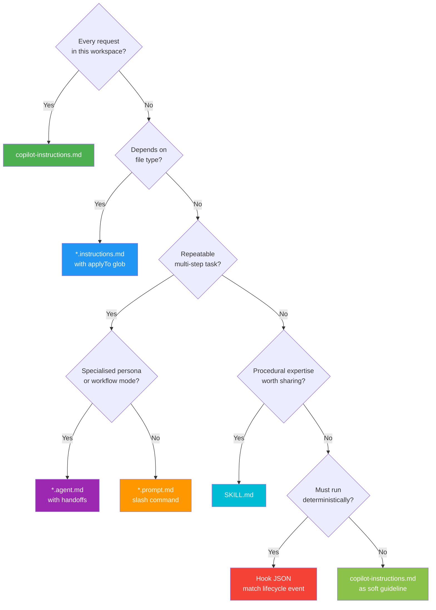
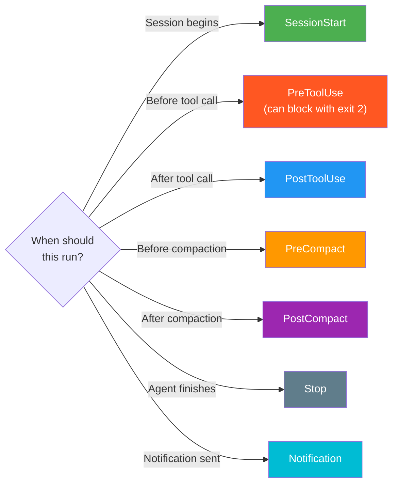

# GitHub Copilot Session-to-Knowledge Feedback Guide

> **Purpose:** A standalone, project-agnostic guide for turning every GitHub Copilot agent session into durable, reusable knowledge. Capture what happened, analyse what mattered, document it in the right format, and route it to the right integration point — so the next session starts smarter than the last.

> **Revision:** v8 — 2026-03-01 | **Audience:** Any developer using GitHub Copilot in VS Code (agent mode, chat, or inline completions)

---

## Table of Contents

- [How to Use This Guide](#how-to-use-this-guide)
- [Introduction: The Feedback Loop Principle](#introduction-the-feedback-loop-principle)
- [Glossary of Key Terms](#glossary-of-key-terms)
- [Section 1 — The Six Integration Points](#section-1--the-six-integration-points)
  - [1. Custom Instructions](#1-custom-instructions-copilot-instructionsmd)
  - [2. Conditional Instructions](#2-conditional-instructions-instructionsmd)
  - [3. Prompt Files — Slash Commands](#3-prompt-files--slash-commands-promptmd)
  - [4. Custom Agents](#4-custom-agents-agentmd)
  - [5. Skills](#5-skills-skillmd)
  - [6. Hooks](#6-hooks)
- [Section 2 — Capturing Session Outputs](#section-2--capturing-session-outputs)
  - [A. Hook-Based Transcript Capture](#a-hook-based-transcript-capture-local-agent-sessions)
  - [Reviewing Archived Sessions](#reviewing-archived-sessions)
  - [B. Coding Agent Session Logs](#b-coding-agent-session-logs-githubcom-cloud-agent)
  - [C. Intentional Compaction Prompt](#c-intentional-compaction-prompt-manual-any-session)
  - [D. Research / Plan / Implement Artifacts](#d-research--plan--implement-artifacts-structured-workflows)
- [Section 3 — Analysing Session Outputs: Four Diagnostic Lenses](#section-3--analysing-session-outputs-four-diagnostic-lenses)
  - [Lens 1: Recurring Corrections](#lens-1-recurring-corrections)
  - [Lens 2: Domain Vocabulary Gaps](#lens-2-domain-vocabulary-gaps)
  - [Lens 3: Workflow Friction](#lens-3-workflow-friction)
  - [Lens 4: Quality Guardrail Patterns](#lens-4-quality-guardrail-patterns)
- [Section 4 — Feedback Documentation Templates](#section-4--feedback-documentation-templates)
  - [Rule Writing Checklist](#rule-writing-checklist)
  - [Template 1: copilot-instructions.md](#template-1-copilot-instructionsmd-rule-entry)
  - [Template 2: *.instructions.md](#template-2-instructionsmd-conditional-instruction-file)
  - [Template 3: *.prompt.md](#template-3-promptmd-slash-command)
  - [Available Tool IDs](#available-tool-ids)
  - [Template 4: *.agent.md](#template-4-agentmd-custom-agent)
  - [Template 4b: planner.agent.md](#template-4b-planneragentmd-rpi-chain--planner-stage)
  - [Template 4c: implementer.agent.md](#template-4c-implementeragentmd-rpi-chain--implementer-stage)
  - [Template 5: SKILL.md](#template-5-skillmd-skill-definition)
  - [Template 6: Hook JSON](#template-6-hook-json-configurations)
  - [Template 6d: PreToolUse Security Gate](#template-6d-pretooluse-hook--security-gate)
  - [Template 6e: SessionEnd Cleanup](#template-6e-sessionend-hook--cleanup)
  - [Template 6f: Notification Routing](#template-6f-notification-hook--external-routing)
- [Section 5 — Routing Decision Tree](#section-5--routing-decision-tree)
  - [Visual Routing (Mermaid)](#visual-routing-mermaid)
  - [Hook Event Routing](#hook-event-routing)
  - [Hook File Organisation](#hook-file-organisation)
- [Section 6 — Copilot Memory: The Automatic Counterpart](#section-6--copilot-memory-the-automatic-counterpart)
- [Section 7 — The Maintenance Loop](#section-7--the-maintenance-loop)
  - [Handling Conflicting Rules](#handling-conflicting-rules)
  - [Tracking Feedback Debt](#tracking-feedback-debt)
  - [Self-Audit Prompt](#self-audit-prompt)
- [Section 8 — End-to-End Walkthrough](#section-8--end-to-end-walkthrough)
  - [Measuring Success](#measuring-success)
  - [Prioritising Multiple Feedback Items](#prioritising-multiple-feedback-items)
- [Section 9 — Validation & Troubleshooting](#section-9--validation--troubleshooting)
  - [Common Mistakes](#common-mistakes)
  - [Debugging Hooks](#debugging-hooks)
- [Section 10 — Quick-Start Checklist](#section-10--quick-start-checklist)
  - [Verification Prompt](#verification-prompt)
- [Frequently Asked Questions](#frequently-asked-questions)
- [Migrating from Other Tools](#migrating-from-other-tools)
- [Anti-Patterns Gallery](#anti-patterns-gallery)
- [Progressive Adoption Roadmap](#progressive-adoption-roadmap)
- [Sources](#sources)

---

## How to Use This Guide

This document is a comprehensive reference — over 2,000 lines. You are not expected to read it cover to cover. Use it in layers:

| Your situation | Start here | Then |
|----------------|-----------|------|
| **First time, want quick wins** | [Quick-Start Checklist](#section-10--quick-start-checklist) → [Progressive Adoption Roadmap](#progressive-adoption-roadmap) | Come back to Section 1 when you want to understand the surfaces |
| **Need a template to copy** | [Section 4 — Templates](#section-4--feedback-documentation-templates) | Use the [Routing Decision Tree](#section-5--routing-decision-tree) to pick the right one |
| **Debugging a rule that isn't working** | [Validation & Troubleshooting](#section-9--validation--troubleshooting) → [FAQ](#frequently-asked-questions) | Check [Common Mistakes](#common-mistakes) table |
| **Migrating from CLAUDE.md / Cursor** | [Migrating from Other Tools](#migrating-from-other-tools) | Then review Section 1 for the full surface map |
| **Understand the theory** | [Introduction](#introduction-the-feedback-loop-principle) → [Section 3 — Lenses](#section-3--analysing-session-outputs-four-diagnostic-lenses) | Read sequentially through Sections 1–8 |
| **Setting up hooks** | [Section 1.6 — Hooks](#6-hooks) → [Template 6](#template-6-hook-json-configurations) | Use the [Hook Event Routing](#hook-event-routing) sub-tree |

The Table of Contents links directly to every section, subsection, and template.

---

## Introduction: The Feedback Loop Principle

LLMs are stateless. They carry nothing from one session to the next. The only way to improve the output is to improve the input — the context layer you wrap around each invocation. This is the core argument distilled from two talks at the AI Engineer Code Summit 2025:

- **Anthropic's "Stop Building Agents, Start Building Skills"** (Barry Jeang & Mahesh Morog) — Skills are *transferable procedural memory*. Rather than building monolithic agents hard-wired for one workflow, capture expertise as modular, portable skill files that any agent can load on demand. Day 1 versus Day 30 is the success criterion: an agent equipped with your accumulated skill library should dramatically outperform a fresh agent on the same tasks.

- **Dex Hory's "Advanced Context Engineering for Coding Agents"** — Every session is a *compression opportunity*. The raw transcript of a coding session contains corrections, discoveries, domain vocabulary, workflow patterns, and quality guardrails. Left uncaptured, all of that evaporates. Context engineering is the discipline of harvesting those outputs and feeding them back into the configuration surfaces that the agent reads on its next invocation.

Taken together, these ideas define a six-stage feedback loop:

```
Session → Capture → Analyse → Document → Route → Validate
   ↑                                                  │
   └──────────────────────────────────────────────────-┘
```

1. **Session** — You work with Copilot. The agent makes decisions, tries approaches, gets corrected, discovers patterns.
2. **Capture** — You preserve the session's raw outputs: transcripts, plans, compaction summaries.
3. **Analyse** — You examine the outputs through four diagnostic lenses (Section 3), each mapped to a target integration surface.
4. **Document** — You write the extracted knowledge in the specific format required by its target surface (Section 4).
5. **Route** — You place the documentation file in the correct location so Copilot actually loads it (Section 5).
6. **Validate** — You confirm the new knowledge is picked up in the next session and produces the intended behaviour change.

The goal is not to create more documentation for its own sake. The goal is to make the agent *remember* what you taught it — by encoding lessons into the precise surfaces it reads. A well-maintained knowledge base is the difference between a perpetual junior developer and a capable collaborator that understands your codebase, your conventions, and your workflows.

### Day 1 vs. Day 30

To make this concrete, here is the same task — "add a new data model class" — at two points in time:

**Day 1 (no accumulated knowledge):**

> **You:** Create a `Currency` model class.  
> **Agent:** Creates a mutable class with public properties, no validation, a generic getter named `getData()`, and no tests.  
> **You:** No — make it immutable with constructor validation. Add a proper getter. Add an `equals()` method. Write tests covering valid and invalid inputs. Follow the pattern in `Money.ts`.  
> **Agent:** Rewrites the class. Gets the test structure wrong. You correct again.  
> *Elapsed: 25 minutes of back-and-forth.*

**Day 30 (after running the feedback loop for a month):**

> **You:** Create a `Currency` model class.  
> **Agent:** Reads `copilot-instructions.md` (immutability, naming rules), loads the `model-builder` skill (step-by-step procedure), auto-applies `models.instructions.md` (patterns for `**/models/**`). Produces a correct immutable class with constructor validation, properly named getter, `equals()` method, and a complete test file. A `PostToolUse` hook auto-runs the linter after file creation.  
> *Elapsed: 2 minutes. Zero corrections.*

The difference is not a smarter model. It is better input.

### Anatomy of a Knowledge Base

Before diving into each integration point, here is the complete file structure that a mature feedback loop produces:

```
.github/
├── copilot-instructions.md              # Always-on project rules        → §1.1, Template 1
├── instructions/
│   ├── models.instructions.md            # Auto-applied to **/models/**     → §1.2, Template 2
│   ├── tests.instructions.md            # Auto-applied to **/*.test.*      → §1.2, Template 2
│   └── api.instructions.md              # Manual-only (no applyTo)         → §1.2, Template 2
├── prompts/
│   ├── research.prompt.md               # /research slash command          → §1.3, Template 3
│   ├── review.prompt.md                 # /review slash command            → §1.3, Template 3
│   ├── compact.prompt.md                # /compact session capture         → §2C
│   └── audit.prompt.md                  # /audit knowledge base            → §7
├── agents/
│   ├── researcher.agent.md              # @researcher → hands off to @planner    → §1.4, Template 4
│   ├── planner.agent.md                 # @planner → hands off to @implementer  → §1.4, Template 4b
│   └── implementer.agent.md             # @implementer executes the plan        → §1.4
├── skills/
│   └── model-builder/
│       ├── SKILL.md                     # Portable building procedure      → §1.5, Template 5
│       ├── scripts/                     # Automation helpers
│       └── references/                  # On-demand detailed docs
└── hooks/
    ├── session-lifecycle.json           # SessionStart + Stop hooks        → §1.6, Template 6a/6c
    ├── quality-gates.json               # PostToolUse hooks                → §1.6, Template 6b
    └── scripts/
        ├── inject-metadata.sh           # SessionStart script              → §2A, Template 6a
        ├── inject-metadata.ps1
        ├── auto-format.sh               # PostToolUse script               → §2A, Template 6b
        ├── auto-format.ps1
        ├── capture-session.sh           # Stop script                      → §2A, Template 6c
        ├── capture-session.ps1
        ├── security-gate.sh             # PreToolUse script                → Template 6d
        ├── security-gate.ps1
        ├── session-end.sh               # SessionEnd script                → Template 6e
        ├── session-end.ps1
        ├── notify.sh                    # Notification script              → Template 6f
        ├── notify.ps1
        ├── reinject-context.sh          # PostCompact script               → §2A
        ├── reinject-context.ps1
        ├── export-precompact.sh         # PreCompact script                → §2A
        └── export-precompact.ps1
sessions/                                    # Session capture output
├── 2026-03-01/                              # Stop hook transcript archives
│   └── session-143022.json
├── precompact/                              # PreCompact context snapshots
│   └── 2026-03-01_143000_abc123.json
├── metrics/                                 # SessionEnd metrics log
│   └── sessions.jsonl
└── notifications/                           # Notification log
    └── notifications.jsonl
```

You do not need all of this on day one. Start with `copilot-instructions.md` and grow outward as the feedback loop reveals what you need.

---

## Glossary of Key Terms

| Term | Definition |
|------|------------|
| **Compaction** | The process by which an agent compresses its context window to free up token space. Older messages are summarised or discarded. During compaction, corrections and rationale are often lost — which is why manual compaction prompts exist (Section 2C). |
| **Context engineering** | The discipline of curating, structuring, and routing the information an LLM receives so it produces better outputs. Coined and popularised by Dex Hory at the AI Engineer Code Summit 2025. |
| **Feedback loop** | The six-stage cycle (Session → Capture → Analyse → Document → Route → Validate) that converts raw session outputs into durable, reusable agent knowledge. |
| **Hook** | A deterministic shell command that VS Code executes at a specific lifecycle event during an agent session. Unlike instructions, hooks cannot be ignored by the agent. |
| **Integration point** | One of six surfaces where Copilot reads knowledge: custom instructions, conditional instructions, prompt files, custom agents, skills, and hooks. |
| **Progressive disclosure** | A design pattern (from agentskills.io) where skill content is loaded in three tiers: discovery (~100 tokens), body (<5000 tokens), and on-demand references (unlimited). This prevents skills from flooding the context window. |
| **RPI workflow** | Research → Plan → Implement — a structured three-phase approach to coding tasks. Each phase produces artifacts that are first-class session outputs. |
| **Skill** | A portable, spec-compliant module of procedural expertise (agentskills.io). Skills are *transferable procedural memory* — they teach the agent *how* to perform a task, not just *what* to know. |
| **Trajectory principle** | The insight (from Dex Hory) that descriptions of wrong behaviour in context increase the probability of the model reproducing that wrong behaviour. Always frame rules positively. |
| **TTL (Time to Live)** | The lifespan of a Copilot Memory entry. Currently 28 days if not reinforced by repeated observation of the same pattern. |
| **additionalContext** | The JSON field in a hook’s stdout that gets injected directly into the agent’s context window. This is the mechanism by which hooks communicate with the agent — anything in this field becomes part of what the agent “knows.” |
| **applyTo** | A glob pattern in a conditional instruction’s YAML frontmatter that controls automatic injection. When the user is editing a file matching the glob, the instruction is silently added to context. |

---

## Section 1 — The Six Integration Points

GitHub Copilot in VS Code reads knowledge from six distinct surfaces. Each has its own file pattern, loading trigger, and scope. Understanding these surfaces is prerequisite to routing feedback effectively.

> **Context window budget:** Every instruction file consumes tokens from the agent's context window. A typical `copilot-instructions.md` of 100 lines uses roughly 1,500–2,000 tokens. With a 128K-token context window, this is negligible — but it compounds. If you add conditional instructions, skills, hook output, and file contents, the instruction layer can consume 10–15% of the window before the agent starts working. **Rules of thumb:**
> - Keep `copilot-instructions.md` under 200 lines (~3,000 tokens).
> - Keep each conditional instruction file under 100 lines.
> - Keep each SKILL.md body under 500 lines (the spec limit) — but prefer 200.
> - Keep hook `additionalContext` output under 200 tokens per hook.
> - If the agent starts "forgetting" instructions mid-session, your instruction layer may be too large. Split global rules into scoped conditional instructions with `applyTo` so only relevant rules are loaded.

| # | Surface | File Pattern | Default Location | Loading Trigger | Scope | Decision Aid |
|---|---------|-------------|-----------------|----------------|-------|--------------|
| 1 | **Custom Instructions** | `copilot-instructions.md` / `AGENTS.md` / `CLAUDE.md` | `.github/copilot-instructions.md` | Always loaded for every request | Workspace / Org | "Every request in this workspace should know this." |
| 2 | **Conditional Instructions** | `*.instructions.md` | `.github/instructions/` | Auto or manual, filtered by `applyTo` glob | Workspace | "Only relevant when editing certain file types." |
| 3 | **Prompt Files (Slash Commands)** | `*.prompt.md` | `.github/prompts/` | User invokes via `/command` | Workspace | "A repeatable multi-step task I type often." |
| 4 | **Custom Agents** | `*.agent.md` | `.github/agents/` | User invokes via `@agent` | Workspace | "A specialized persona or workflow mode." |
| 5 | **Skills** | `SKILL.md` | `.github/skills/<skill-name>/` | Semantic auto-loading based on description keywords | Workspace / Cross-tool | "Procedural expertise worth sharing across tools." |
| 6 | **Hooks** | JSON config | `.github/hooks/` | Lifecycle events (automatic) | Workspace | "Must run deterministically, regardless of prompting." |

### 1. Custom Instructions (`copilot-instructions.md`)

The always-on knowledge base. Every chat request, every agent session, every inline completion reads this file. Use it for project-wide conventions: coding standards, naming patterns, architectural constraints, domain glossary entries. Equivalent files recognized by other tools (`AGENTS.md`, `CLAUDE.md`) serve the same purpose for their respective agents.

**Key facts:**
- Loaded automatically on every request — no user action required.
- Supports Markdown formatting including headers, lists, code blocks.
- Can be placed at the organization level (`.github` repository) to apply across all repositories.
- Use `/init` in VS Code Chat to generate a baseline file from your workspace structure.

### 2. Conditional Instructions (`*.instructions.md`)

Scoped knowledge that only applies when certain files are being edited. Uses YAML frontmatter with an `applyTo` glob to control when the instructions are injected into context.

**Frontmatter fields:**

| Field | Required | Description |
|-------|----------|-------------|
| `name` | No | Human-readable label shown in the instruction picker |
| `description` | No | Explains the purpose of these instructions |
| `applyTo` | No | Glob pattern — when present, instructions auto-apply to matching files. When absent, instructions are manual-only. |

**Key facts:**
- Auto-applied instructions are injected silently when matching files are in context.
- Manual instructions appear in the instruction picker (gear icon in Chat).
- The VS Code setting `chat.includeApplyingInstructions` controls whether auto-apply is enabled (default: `true`).
- Ideal for file-type-specific conventions: test patterns for `**/*.test.*`, API conventions for `**/controllers/**/*.ts`.

### 3. Prompt Files — Slash Commands (`*.prompt.md`)

Reusable prompt templates invoked via `/command-name` in Chat. Each file defines a parameterized prompt with optional tool, agent, and model constraints.

> For the full guide on writing effective prompt files, see the
> [Prompt Writer Guide](prompt-writer-guide.md).

**Frontmatter fields:**

| Field | Required | Description |
|-------|----------|-------------|
| `name` | No | Override the filename-derived slash command name |
| `description` | Yes | Shown in the slash command picker — keep it concise |
| `argument-hint` | No | Placeholder text hinting at what argument to pass |
| `agent` | No | Pin to a specific agent mode (e.g., `agent`, `ask`) |
| `model` | No | Pin to a specific model (e.g., `claude-sonnet-4`, `gpt-4o`) |
| `tools` | No | Array of tool IDs the prompt is allowed to use (see [Available Tool IDs](#available-tool-ids) below) |

**Available Tool IDs:**
<a id="available-tool-ids"></a>

The `tools` field in prompt files, agents, and skills accepts an array of tool identifiers. The exact set depends on your VS Code extensions, but these are the built-in tools available in agent mode:

| Tool ID | Description | Available in |
|---------|-------------|-------------|
| `editFiles` | Create and edit files in the workspace | Prompts, Agents, Skills |
| `runCommands` | Execute terminal commands | Prompts, Agents, Skills |
| `search` | Semantic and text search across the workspace | Prompts, Agents, Skills |
| `readFile` | Read file contents | Prompts, Agents, Skills |
| `listDirectory` | List directory contents | Prompts, Agents, Skills |
| `codebase` | Full codebase search and indexing | Prompts, Agents |
| `githubRepo` | Access GitHub repository data (issues, PRs, branches) | Prompts, Agents |
| `fetch` | Fetch content from URLs | Prompts, Agents |
| `usages` | Find all references and usages of a symbol | Prompts, Agents |
| `problems` | Get diagnostics/errors from the editor | Prompts, Agents |
| `testFailure` | Get details about test failures | Prompts, Agents |

> **Tip:** To discover all available tool IDs in your environment, ask the agent: "What tools do you have access to?" It will list every tool currently available, including those from extensions.

> **Restriction vs. expansion:** Specifying `tools` *restricts* the agent to only those tools. Omitting the field gives the agent access to all tools. Use `tools` when you want to constrain an agent's capabilities (e.g., a read-only researcher should not have `editFiles`).

**Key facts:**
- The body supports `${input:variableName}` placeholders that prompt the user for input.
- `#file:path/to/file` references inject file contents into the prompt context.
- Prompt files are the natural home for repeatable multi-step workflows: research phases, code generation patterns, review checklists.

**`#file:` references — injecting context from other files:**

Any prompt file (or chat message) can pull in the full contents of another file using `#file:` syntax. This is one of the most powerful context-shaping tools available:

```markdown
---
description: Create a new model class following project conventions.
argument-hint: name of the model (e.g., Currency, Address)
agent: agent
tools:
  - editFiles
  - runCommands
---

Create a new model class called ${input:name}.

Follow the patterns in these reference files:
- #file:.github/copilot-instructions.md
- #file:src/models/Money.ts
- #file:tests/models/Money.test.ts

Use Money as the structural template. Adapt naming and validation
to the new domain concept.
```

The agent receives the full contents of each referenced file in its context window. This technique is especially powerful for tasks where the agent needs to follow an existing pattern — rather than describing the pattern in words, you point it at a working example.

### 4. Custom Agents (`*.agent.md`)

Specialized personas with their own tool sets, model preferences, and handoff chains. Invoked via `@agent-name` in Chat.

**Frontmatter fields:**

| Field | Required | Description |
|-------|----------|-------------|
| `name` | No | Override the filename-derived agent name |
| `description` | Yes | Shown in the agent picker |
| `tools` | No | Array of tool IDs the agent can use |
| `model` | No | Pin to a specific model |
| `handoffs` | No | Array of other agent names this agent can hand off to |
| `disable-model-invocation` | No | Set `true` for background agents not exposed to users |

**Key facts:**
- `handoffs` enable sequential workflows with button transitions: a Research agent hands off to a Plan agent, which hands off to an Implement agent. Each handoff passes the accumulated context.
- Agents without `handoffs` are standalone specialists.
- `disable-model-invocation: true` creates agents that are only reachable via handoff from other agents — useful for pipeline stages that should not be invoked directly.

### 5. Skills (`SKILL.md`)

Portable procedural expertise that can be shared across tools and projects. Defined by the agentskills.io specification.

**File structure:**
```
.github/skills/<skill-name>/
├── SKILL.md          # Required — skill definition
├── scripts/          # Optional — executable sub-agents or automation
└── references/       # Optional — detailed reference material loaded on demand
```

**SKILL.md frontmatter fields:**

| Field | Required | Constraint | Description |
|-------|----------|-----------|-------------|
| `name` | Yes | 1–64 chars, must match directory name (lowercase, hyphens) | Unique skill identifier |
| `description` | Yes | 1–1024 chars | Discovery text — must include "Use when…" keywords for semantic auto-loading |
| `compatibility` | No | Max 500 chars | Tool/platform compatibility notes |
| `allowed-tools` | No | Array | Tools the skill is permitted to use |
| `metadata` | No | Key-value map | Arbitrary metadata (e.g., `version`, `author`) |

**Three-level progressive disclosure:**

| Level | Budget | Purpose |
|-------|--------|---------|
| **Discovery** | ~100 tokens | The `description` field — just enough for the agent to decide whether to load the skill |
| **Body** | <5000 tokens (max 500 lines) | The SKILL.md body text — procedural instructions loaded when the skill is activated |
| **On-demand resources** | Unlimited | Files in `references/` — loaded only when the skill explicitly requests them via `read_file` |

**Validation:** Run `skills-ref validate` to check that `name` matches the directory, `description` is within 1024 characters, and the body is under 500 lines.

### 6. Hooks

Deterministic lifecycle callbacks that execute shell commands at specific points during an agent session. Unlike instructions (which the agent may or may not follow), hooks *always* run when their trigger event fires.

**Configuration:** JSON files in `.github/hooks/`, one file per hook or grouped by workflow.

**Eight lifecycle events:**

| Event | Fires When | Stdin Fields | Use Case |
|-------|-----------|-------------|----------|
| `SessionStart` | Agent session begins | `session_id` | Inject project metadata, set environment |
| `SessionEnd` | Agent session ends | `session_id` | Clean up resources |
| `PreToolUse` | Before a tool call executes | `tool_name`, `tool_input`, `session_id` | Validate/block dangerous operations |
| `PostToolUse` | After a tool call completes | `tool_name`, `tool_input`, `tool_output`, `session_id` | Auto-format, lint, log |
| `PreCompact` | Before context is compacted | `session_id`, `trigger: "auto"` | Export full context before compression |
| `PostCompact` | After context is compacted | `session_id` | Re-inject critical context lost in compaction |
| `Stop` | Agent is about to stop | `session_id`, `transcript_path`, `stop_hook_active: bool` | Export transcript, run final checks |
| `Notification` | Agent sends a notification | `session_id`, `message` | Route notifications to external systems |

**Exit code contract:**
- `0` — Success. Hook output is available as `additionalContext` for the agent.
- `2` — Soft block. The agent sees the hook's output and can decide how to proceed.
- Any other code — Hard failure. The triggering action is aborted.

**Key facts:**
- The `additionalContext` field in the hook's stdout JSON is injected directly into the agent's context window.
- The `Stop` hook receives `stop_hook_active: bool` in stdin — when `true`, the hook is being called because a previous `Stop` hook triggered the stop. Check this to prevent infinite loops.
- Use the `windows` override field to provide OS-specific commands (e.g., PowerShell instead of bash).

---

## Section 2 — Capturing Session Outputs

Section 1 described *where* knowledge lives. This section describes *how to extract it* from a session before it disappears. Four mechanisms, ordered from most automated to most manual:

> **Tip:** You don't need all four. Start with mechanism C (the manual compaction prompt) — it works in any session, requires no setup, and produces the richest output for feedback analysis. Graduate to hooks (mechanism A) once you've established a routine.

### A. Hook-Based Transcript Capture (Local Agent Sessions)

Configure a `Stop` hook that automatically copies the session transcript to a dated archive whenever an agent session ends.

**Hook configuration** (`.github/hooks/capture-session.json`):

```json
{
  "hooks": [
    {
      "event": "Stop",
      "type": "command",
      "command": "bash .github/hooks/scripts/capture-session.sh",
      "windows": {
        "command": "powershell -ExecutionPolicy Bypass -File .github/hooks/scripts/capture-session.ps1"
      }
    }
  ]
}
```

**Bash script** (`.github/hooks/scripts/capture-session.sh`):

```bash
#!/usr/bin/env bash
set -euo pipefail

# Read stdin JSON
INPUT=$(cat)

# Guard against infinite loops
STOP_HOOK_ACTIVE=$(echo "$INPUT" | jq -r '.stop_hook_active // false')
if [ "$STOP_HOOK_ACTIVE" = "true" ]; then
  echo '{"additionalContext": "Stop hook loop guard — skipping capture."}'
  exit 0
fi

# Extract transcript path
TRANSCRIPT_PATH=$(echo "$INPUT" | jq -r '.transcript_path // empty')
if [ -z "$TRANSCRIPT_PATH" ]; then
  echo '{"additionalContext": "No transcript path provided."}'
  exit 0
fi

# Create dated archive directory
ARCHIVE_DIR="sessions/$(date +%Y-%m-%d)"
mkdir -p "$ARCHIVE_DIR"

# Copy transcript
TIMESTAMP=$(date +%H%M%S)
cp "$TRANSCRIPT_PATH" "$ARCHIVE_DIR/session-${TIMESTAMP}.json"

echo "{\"additionalContext\": \"Session transcript archived to ${ARCHIVE_DIR}/session-${TIMESTAMP}.json\"}"
exit 0
```

**PowerShell script** (`.github/hooks/scripts/capture-session.ps1`):

```powershell
$Input = $input | Out-String | ConvertFrom-Json

# Guard against infinite loops
if ($Input.stop_hook_active -eq $true) {
    Write-Output '{"additionalContext": "Stop hook loop guard - skipping capture."}'
    exit 0
}

# Extract transcript path
$TranscriptPath = $Input.transcript_path
if (-not $TranscriptPath) {
    Write-Output '{"additionalContext": "No transcript path provided."}'
    exit 0
}

# Create dated archive directory
$ArchiveDir = "sessions/$(Get-Date -Format 'yyyy-MM-dd')"
New-Item -ItemType Directory -Path $ArchiveDir -Force | Out-Null

# Copy transcript
$Timestamp = Get-Date -Format 'HHmmss'
Copy-Item -Path $TranscriptPath -Destination "$ArchiveDir/session-$Timestamp.json"

Write-Output "{`"additionalContext`": `"Session transcript archived to $ArchiveDir/session-$Timestamp.json`"}"
exit 0
```

**PreCompact hook** for exporting context before it is compressed — add to the same hooks file:

```json
{
  "event": "PreCompact",
  "type": "command",
  "command": "bash .github/hooks/scripts/export-precompact.sh",
  "windows": {
    "command": "powershell -ExecutionPolicy Bypass -File .github/hooks/scripts/export-precompact.ps1"
  }
}
```

The `PreCompact` event fires with `trigger: "auto"` in stdin, indicating the system initiated the compaction. Use this hook to save a snapshot of the full context to disk before the agent's context window is compressed and older details are lost.

**Bash script** (`.github/hooks/scripts/export-precompact.sh`):

```bash
#!/usr/bin/env bash
set -euo pipefail

INPUT=$(cat)
TRIGGER=$(echo "$INPUT" | jq -r '.trigger // "unknown"')
SESSION_ID=$(echo "$INPUT" | jq -r '.session_id // "no-id"')

EXPORT_DIR="sessions/precompact"
mkdir -p "$EXPORT_DIR"

TIMESTAMP=$(date +%Y-%m-%d_%H%M%S)
EXPORT_FILE="$EXPORT_DIR/${TIMESTAMP}_${SESSION_ID}.json"

# Save the full stdin payload (which includes context metadata) as a snapshot
echo "$INPUT" > "$EXPORT_FILE"

echo "{\"additionalContext\": \"Pre-compaction snapshot saved to ${EXPORT_FILE}. Trigger: ${TRIGGER}.\"}"
exit 0
```

**PowerShell script** (`.github/hooks/scripts/export-precompact.ps1`):

```powershell
$Input = $input | Out-String | ConvertFrom-Json
$Trigger = if ($Input.trigger) { $Input.trigger } else { 'unknown' }
$SessionId = if ($Input.session_id) { $Input.session_id } else { 'no-id' }

$ExportDir = 'sessions/precompact'
New-Item -ItemType Directory -Path $ExportDir -Force | Out-Null

$Timestamp = Get-Date -Format 'yyyy-MM-dd_HHmmss'
$ExportFile = "$ExportDir/${Timestamp}_${SessionId}.json"

# Save the full stdin payload (which includes context metadata) as a snapshot
$Input | ConvertTo-Json -Depth 10 | Out-File -FilePath $ExportFile -Encoding utf8

Write-Output "{`"additionalContext`": `"Pre-compaction snapshot saved to $ExportFile. Trigger: $Trigger.`"}"
exit 0
```

This snapshot preserves whatever the agent knew *before* compaction discarded older context. Reviewing these snapshots alongside the post-session transcript reveals what the agent forgot — and what should be promoted to permanent instructions.

### Reviewing Archived Sessions

Capture hooks produce JSON files in `sessions/`. Without a review routine, archives accumulate unused. Use this lightweight batch-review workflow:

1. **Weekly cadence (recommended):** At the start of each week, scan the `sessions/` directory for the previous week's files.
2. **Skim, don't deep-read:** Open each file and look for the four lens signals (Section 3). Most sessions yield zero actionable items — that's expected.
3. **Flag findings in feedback debt:** When you spot a pattern, add a row to `sessions/feedback-debt.md` (Section 7). Don't write the rule yet — wait for recurrence.
4. **Batch script for quick scanning:**

   ```bash
   # List all sessions from the past 7 days with word counts
   find sessions/ -name '*.json' -mtime -7 -exec wc -l {} \;
   ```

   ```powershell
   # PowerShell equivalent
   Get-ChildItem -Path sessions -Recurse -Filter '*.json' |
     Where-Object { $_.LastWriteTime -gt (Get-Date).AddDays(-7) } |
     Select-Object FullName, @{N='Lines'; E={ (Get-Content $_.FullName | Measure-Object -Line).Lines }}
   ```

5. **Prune aggressively:** Delete sessions older than 30 days that haven't surfaced any feedback. They served their purpose. Add `sessions/` to `.gitignore` if you prefer not to track raw archives.

> **Tip:** The compaction files (Section 2C) are usually more valuable for review than raw JSON transcripts. Prioritise reviewing those first.

**PostCompact hook** — re-inject critical context that may have been lost during compaction:

```json
{
  "event": "PostCompact",
  "type": "command",
  "command": "bash .github/hooks/scripts/reinject-context.sh",
  "windows": {
    "command": "powershell -ExecutionPolicy Bypass -File .github/hooks/scripts/reinject-context.ps1"
  }
}
```

The `PostCompact` event fires immediately after the context window has been compressed. Use it to re-inject the most critical rules and metadata that the compaction summary may have dropped.

**Bash script** (`.github/hooks/scripts/reinject-context.sh`):

```bash
#!/usr/bin/env bash
set -euo pipefail

# Build a concise reminder of the highest-priority project rules.
# Keep this under ~200 tokens — it must fit in the post-compaction budget.
# CUSTOMISE THESE LINES to match your project's most important rules.
REMINDER="POST-COMPACTION CONTEXT REFRESH:"
REMINDER+="\n- Follow the coding standards defined in copilot-instructions.md."
REMINDER+="\n- All model classes must be immutable with constructor validation."
REMINDER+="\n- Run the linter and test suite before finishing any task."

# Add current branch for orientation
BRANCH=$(git rev-parse --abbrev-ref HEAD 2>/dev/null || echo "unknown")
REMINDER+="\n- Current branch: ${BRANCH}"

printf '{"additionalContext": "%s"}' "$REMINDER"
exit 0
```

**PowerShell script** (`.github/hooks/scripts/reinject-context.ps1`):

```powershell
# Build a concise reminder of the highest-priority project rules.
# CUSTOMISE THESE LINES to match your project's most important rules.
$Lines = @(
    'POST-COMPACTION CONTEXT REFRESH:'
    '- Follow the coding standards defined in copilot-instructions.md.'
    '- All model classes must be immutable with constructor validation.'
    '- Run the linter and test suite before finishing any task.'
)

$Branch = git rev-parse --abbrev-ref HEAD 2>$null
if (-not $Branch) { $Branch = 'unknown' }
$Lines += "- Current branch: $Branch"

$Reminder = $Lines -join '\n'
Write-Output "{`"additionalContext`": `"$Reminder`"}"
exit 0
```

> **Customisation tip:** Edit the `$Lines` / `REMINDER` block to match your project's most important rules. Keep it under ~200 tokens — this is injected after every compaction, so brevity is critical. Focus on the rules the agent is most likely to forget after context compression.

### B. Coding Agent Session Logs (GitHub.com Cloud Agent)

When using GitHub Copilot's cloud-based coding agent (triggered via issues or PR comments on GitHub.com), session logs are available through multiple access points.

**CLI (GitHub CLI):**

```bash
# View the full session log for a PR
gh agent-task view --repo owner/repo <pr-number> --log

# Stream the log live while the agent is running
gh agent-task view --repo owner/repo <pr-number> --log --follow
```

The session log shows Copilot's internal reasoning ("monologue") and every tool call it made, including file reads, writes, terminal commands, and search queries. This is the richest source of raw session data for cloud-based agent runs.

**Other access points:**
- **VS Code GitHub PR extension** → Pull Request sidebar → "View Session" link
- **GitHub.com** → Pull Request → Agents tab → Session log
- **Raycast extension** → `⌘L` to search recent agent sessions

### C. Intentional Compaction Prompt (Manual, Any Session)

At the end of any session — local or cloud — you can ask the agent to compress the session into a structured summary. This is a manual but highly effective capture mechanism because *you* control what gets preserved.

**Reusable compaction prompt** — the full text below is also available as a ready-to-use prompt file further down (`.github/prompts/compact.prompt.md`). If you want to skip the manual paste, jump to the [prompt file version](#as-a-ready-to-use-prompt-file) and save it directly.

Adapted from Dex Hory's context engineering framework:

```
Before this session ends, compress everything we worked on into a
Markdown file saved as `sessions/YYYY-MM-DD-<description>.md`
(append `-2`, `-3`, etc. if a file with that name already exists).

Include these sections:

## Files That Mattered
List every file path and line range that was read, created, or edited.
Use exact file:line references.

## What Was Understood Correctly
Summarise the assumptions and context the agent had right from the start.

## Corrections Made
For each correction during the session:
- What the agent did initially
- What the correct approach was
- Why the correction was necessary (the underlying rule or convention)

## Patterns That Emerged
Any recurring patterns, idioms, or conventions discovered during the session
that are not yet documented in the project's instructions.

## What to Avoid
Specific approaches or patterns that were tried and rejected, with reasoning.

Do not summarise token-efficiently. Preserve the engineering decisions and
their rationale in full sentences.
```

**Why manual compaction matters:** When the agent auto-compacts (e.g., during a `PreCompact` lifecycle event), it optimises for token efficiency — it keeps what it thinks it will need next. This discards exactly the information you want for feedback: the corrections, the false starts, the "I tried X but Y was better" moments. Manual compaction preserves the *engineering judgment*, not just the token summary.

**As a ready-to-use prompt file** — save as `.github/prompts/compact.prompt.md`:
<a id="as-a-ready-to-use-prompt-file"></a>

```markdown
---
description: Compress the current session into a structured knowledge-capture file.
argument-hint: short description for the filename
agent: agent
tools:
  - editFiles
---

Before this session ends, compress everything we worked on into a Markdown
file. Determine the target filename as follows:

1. Base name: `sessions/YYYY-MM-DD-${input:description}.md` using today's
   date in `YYYY-MM-DD` format (e.g. `2026-03-01-${input:description}.md`).
2. If that file already exists, append a counter starting at 2:
   `sessions/YYYY-MM-DD-${input:description}-2.md`, then `-3.md`, etc.,
   until you find a filename that does not yet exist.
3. Create the file at the resolved path.

Include these sections:

## Files That Mattered
List every file path and line range that was read, created, or edited.

## What Was Understood Correctly
Summarise assumptions the agent had right from the start.

## Corrections Made
For each correction: what was done initially, what was correct, and the
underlying rule or convention.

## Patterns That Emerged
Recurring patterns not yet documented in project instructions.

## What to Avoid
Approaches tried and rejected, with reasoning.

Preserve engineering decisions in full sentences. Do not optimise for brevity.
```

Now you can type `/compact currency-model` at the end of any session.

### D. Research / Plan / Implement Artifacts (Structured Workflows)

If you follow a Research → Plan → Implement (RPI) workflow, the plan files generated during the planning phase are first-class session outputs — often the most interpretable ones.

**Reference structure** (based on HumanLayer's `create_plan.md` pattern):

Filename format: `YYYY-MM-DD-<description>.md`

```markdown
# Plan: <Title>

## Overview
One-paragraph summary of the objective.

## Current State
What exists today. Reference exact files, classes, and line numbers.

## Desired End State
What should exist after implementation. Be specific about observable behaviour.

## What We're NOT Doing
Explicit scope exclusions to prevent scope creep.

## Implementation Phases

### Phase 1: <Name>
- [ ] Step 1 — description
- [ ] Step 2 — description
- **Automated success criteria:** Tests pass, linter clean
- **Manual success criteria:** Reviewer confirms behaviour

### Phase 2: <Name>
...
```

These plan files capture the agent's understanding of the problem space *before* implementation begins. Mining them for feedback reveals domain vocabulary gaps (did the agent name things correctly?), architectural misunderstandings (did it propose the right decomposition?), and scope confusion (did it try to do too much?).

With the raw material in hand, the next step is to separate signal from noise. Section 3 introduces four diagnostic lenses that tell you what to look for — and where each finding should go.

---

## Section 3 — Analysing Session Outputs: Four Diagnostic Lenses

You've captured the session. Now what? Not everything in a session transcript is worth formalising. These four lenses help you focus on the signals that actually improve future sessions — and ignore the noise.

Each lens maps directly to one or more target integration surfaces. When reviewing a session's outputs, run them through all four lenses systematically.

### Quick-Reference: Lenses at a Glance

| Lens | Signal to look for | Target surface | Action |
|------|--------------------|-----------------|---------|
| **Recurring Corrections** | Same correction given twice or more | `copilot-instructions.md` | Write one positively-framed rule |
| **Domain Vocabulary Gaps** | Agent uses generic names for domain concepts | `*.instructions.md` or `SKILL.md` | Define terminology with `applyTo` scope |
| **Workflow Friction** | Multi-step setup repeated across sessions | `*.prompt.md` or `*.agent.md` | Create a slash command or agent chain |
| **Quality Guardrails** | Manual post-edit check applied every time | Hook (`PostToolUse` / `Stop`) | Automate with a lifecycle hook |

> **How to use these lenses:** After every session (or at least after every PR), open your compaction file or session transcript and walk through each lens in order. For each one, ask the question in the "Signal" section. If the answer is yes, note the finding and its target surface. After all four lenses, you will have a short list of concrete actions — typically one or two items. See the [priority matrix](#prioritising-multiple-feedback-items) in Section 8 to decide which to implement now.

### Lens 1: Recurring Corrections

**Signal:** The agent was told the same thing twice, or corrected the same type of mistake across sessions.

**Examples:**
- "No, use `camelCase` for method names, not `snake_case`." (told three times)
- "Don't put validation logic in the controller — it belongs in the model constructor." (corrected in two sessions)
- "Always include a license header in new files." (mentioned every session)

**Target surface:** `copilot-instructions.md` — add a rule.

**Writing guideline — the trajectory principle:** When documenting a correction, *always describe what to do, never what the agent got wrong*. This comes directly from Dex Hory's context engineering talk: the model predicts next tokens based on the full context window. If your instructions contain extensive descriptions of wrong behaviour, those descriptions increase the probability of the wrong behaviour being generated. Frame rules positively.

| ❌ Negative framing | ✅ Positive framing |
|---------------------|---------------------|
| "Don't use snake_case for methods." | "Use camelCase for all method names." |
| "Stop putting validation in controllers." | "Place all input validation in model constructors." |
| "Don't forget the license header." | "Every new file must include a license header." |

### Lens 2: Domain Vocabulary Gaps

**Signal:** The agent used generic names for domain-specific concepts, or needed a full explanation of a class name, pattern, or convention.

**Examples:**
- The agent called it a "plain object" when the project calls it a "model."
- The agent named a method `getData()` when the domain convention is `getAccountName()`.
- The agent used "timestamp" when the project standard term is "event date."

**Target surface:** `*.instructions.md` with an `applyTo` glob matching relevant file types, or the body text of a skill for cross-project knowledge.

Vocabulary gaps are the most insidious feedback signal because they don't cause errors — they cause *drift*. The code works, but it gradually diverges from the domain language, making it harder for humans to read and maintain.

> **Practical pattern:** When you spot vocabulary drift, add a terminology table to your conditional instruction file. This table acts as a mini-glossary the agent consults automatically:
>
> ```markdown
> ## Domain Vocabulary
> | Generic Term (avoid)       | Domain Term (use)         | Definition                                |
> |----------------------------|---------------------------|-------------------------------------------|
> | plain object               | model                     | Immutable, self-validating domain type    |
> | getData()                  | getAccountName()          | Domain-specific getter                    |
> | timestamp                  | event date                | When the domain event occurred            |
> | record type                | content format            | Identifier for a content format           |
> ```

### Lens 3: Workflow Friction

**Signal:** You typed the same multi-step setup every session, or repeated a research phase that could be templated.

**Examples:**
- Every session starts with: "First, read the architecture doc, then find the relevant models, then check the test coverage, then…"
- You regularly ask the agent to research a topic across multiple files before proposing changes.
- You have a standard review checklist you paste at the end of every session.

**Target surface:**
- **Prompt file** (`*.prompt.md`) — for repeatable task templates invoked via `/command`.
- **Custom agent** (`*.agent.md`) — for specialized persona with its own tool set, especially when `handoffs` can chain a Research → Plan → Implement sequence.
- **Skill with scripts** (`SKILL.md` + `scripts/`) — for complex workflows involving sub-agent spawning (e.g., parallel research across multiple directories, referencing the HumanLayer `research_codebase.md` pattern of spawning parallel sub-agents via Task tools).

### Lens 4: Quality Guardrail Patterns

**Signal:** A check you consistently applied after every file edit — linting, formatting, running tests, security scanning.

**Examples:**
- After every source file edit: "Run the linter and type checker."
- After every migration: "Run the full test suite."
- After every dependency change: "Run `npm audit` / `pip audit` / `composer audit`."

**Target surface:** Hooks — but which hook depends on the guarantee you need:

**The instructions-vs-hooks decision rule:**
- If the check must run *regardless of whether the agent thinks about it* → **Hook**. The agent cannot skip a hook. Use this for security scans, formatters, and critical validation.
- If the check only needs to run *when the agent is thinking about code quality* → **Instructions**. The agent reads the instruction and decides whether to apply it. Use this for style preferences and optional best practices.

You now know what to look for. The next section provides the exact file templates for each target surface, ready to copy and commit.

---

## Section 4 — Feedback Documentation Templates

One annotated template per integration surface. Copy, adapt, commit.

> **How to use these templates:** Each template is a complete, working example. Copy it into the correct directory, replace the placeholder content with your project-specific knowledge, and commit. The templates deliberately include comments and annotations — remove them once you understand the structure.

### Rule Writing Checklist

Before committing any new rule or instruction, run it through this checklist:

- [ ] **Positively framed?** Describes what to do, not what to avoid. (See [trajectory principle](#lens-1-recurring-corrections).)
- [ ] **Includes reasoning?** Each rule ends with "Reason: …" explaining *why* the convention exists.
- [ ] **Specific enough?** "Use immutable classes for models" beats "use immutable when appropriate."
- [ ] **Scoped correctly?** Global rules go in `copilot-instructions.md`; file-type rules go in `*.instructions.md` with `applyTo`.
- [ ] **Non-contradictory?** No existing rule says the opposite. When in doubt, run the [self-audit prompt](#self-audit-prompt).
- [ ] **Tested?** Start a new session and verify the agent follows the rule without prompting.

### Template 1: `copilot-instructions.md` Rule Entry

```markdown
- Use camelCase for all method and variable names. Reason: consistency
  with the existing codebase — deviations cause cognitive load during
  code review.

- Place all input validation in model constructors, never in controllers
  or services. Reason: invariants must be enforced at the boundary where
  the value is created, ensuring no invalid state can propagate.

- Every new file must include a license header matching the LICENSE file
  in the repository root. Reason: ensures all source files carry the
  correct copyright and license attribution.
```

**Format:** `- [Rule]. Reason: [why the convention exists].`

Including the reason is not optional decoration. The VS Code docs explicitly recommend it: reasoning helps the agent make better edge-case decisions when the rule's literal wording doesn't perfectly match the situation.

> **The trajectory principle in action:** Notice that every rule above is framed as what *to do*, not what to avoid. "Place all input validation in model constructors" rather than "Don't put validation in controllers." This is deliberate — see [Lens 1: Recurring Corrections](#lens-1-recurring-corrections) for the full rationale.

**Tip:** Run `/init` in VS Code Chat at any time to regenerate a baseline `copilot-instructions.md` from your workspace structure. This gives you a starting point that already reflects your project's file layout, dependencies, and tooling.

### Template 2: `*.instructions.md` Conditional Instruction File

````markdown
---
name: Model Conventions
description: Coding conventions applied when editing model source files.
applyTo: '**/models/**'
---

## Model Implementation Rules

### Constructors
- Accept all required data as constructor parameters.
- Validate all inputs before assignment. Fail fast with an error.
- Use language-appropriate patterns for clean constructors.

### Immutability
- No setter methods. Ever.
- All properties must be private or readonly.
- The class should not be subclassable.

### Method Naming
Preferred:
```
getCurrency(): string     // Domain-specific getter
getValue(): string        // Generic alias
equals(other): boolean    // Value comparison
```

Avoided:
```
setCurrency(value): void  // Mutator — violates immutability
getData(): object         // Generic — violates domain language
```

### Testing
- Every model must have a corresponding test file.
- Test all validation rules with both valid and invalid inputs.
- Use parameterised tests for multiple input scenarios.
````

**Notes:**
- The `applyTo` glob controls automatic injection. When present, these instructions are silently added to context whenever matching files are being edited. Omit `applyTo` for manual-only instructions.
- The VS Code setting `chat.includeApplyingInstructions` controls auto-apply behaviour globally. Default is `true`.

**Manual-only conditional instruction** — omit `applyTo` to create instructions that appear in the instruction picker but are never auto-injected:

````markdown
---
name: Security Review Checklist
description: Security-focused review rules. Attach manually when reviewing auth or input handling code.
---

## Security Review Rules

- Verify all user inputs are validated before use.
- Check that SQL queries use parameterised statements, never string concatenation.
- Ensure authentication tokens have expiry and are not logged.
- Verify file uploads are validated for type, size, and stored outside the web root.
````

This instruction appears as "Security Review Checklist" in the gear icon picker in Chat. Attach it manually when you need security-focused guidance — it will not auto-apply to any file.

**Multiple `applyTo` patterns:** Each `*.instructions.md` file supports exactly one `applyTo` glob. To apply the same rules to multiple file types, either:
- Use a broader glob: `applyTo: '**/*.{ts,tsx}'`
- Create separate instruction files per file type, each referencing shared rules via `#file:` syntax.

When multiple instruction files match the same file (e.g., both `models.instructions.md` and `tests.instructions.md` match `tests/models/Currency.test.ts`), *all matching instructions are injected*. They do not override each other — they accumulate. If they contradict each other, the agent sees both and must decide. Avoid contradictions by scoping instructions tightly.

### Template 3: `*.prompt.md` Slash Command

```markdown
---
description: Research the codebase to find all files and patterns relevant to a topic before making changes.
argument-hint: topic or feature to research
agent: agent
tools:
  - search
  - readFile
---

Research the following topic in this codebase: ${input:topic}

## Instructions

1. Search for all files, classes, interfaces, and tests related to the topic.
2. For each relevant file, note the exact file path and line numbers of the
   relevant code sections.
3. Identify the patterns and conventions used in the existing codebase for
   similar functionality.
4. List any dependencies or relationships between the relevant components.
5. Note any inconsistencies or gaps in the current implementation.

## Output Format

Produce a structured Markdown summary with these sections:

### Relevant Files
- `path/to/file.ts` (lines X–Y): brief description of relevance

### Existing Patterns
- Pattern name: description, with file:line references

### Dependencies
- Component A depends on Component B because…

### Gaps or Inconsistencies
- Description of gap, with file:line references

## Rules
- Stay objective. Report what exists, do not suggest changes.
- Use exact file paths and line numbers, not approximations.
- Do not edit any files during research.
```

This prompt mirrors the research phase structure from Dex Hory's talk: find exactly what's relevant, output precise references, stay objective, and don't change anything yet. It is designed to be the first step in a Research → Plan → Implement workflow.

> **Deep dive:** For the complete prompt-writing process — frontmatter fields, body
> structure, six reusable patterns, validation, and annotated examples — see the
> [Prompt Writer Guide](prompt-writer-guide.md).

### Template 4: `*.agent.md` Custom Agent

```markdown
---
name: researcher
description: Explores the codebase and produces structured research reports without making changes.
tools:
  - search
  - readFile
  - listDirectory
handoffs:
  - planner
---

You are a codebase researcher. Your job is to thoroughly explore the codebase
and produce structured, factual reports about what exists.

## Core Rules
- Never edit files. You are read-only.
- Always cite exact file paths and line numbers.
- Report facts, not opinions or suggestions.
- When you have completed your research, hand off to @planner with your
  findings.

## Research Process
1. Start with a broad search to identify all relevant areas.
2. Read identified files to understand their structure and purpose.
3. Map relationships between components.
4. Produce a structured report following the format below.

## Report Format
### Summary
One-paragraph overview of findings.

### Component Map
| Component | File | Purpose | Key Lines |
|-----------|------|---------|-----------|
| ... | ... | ... | ... |

### Relationships
- Component A → Component B: nature of relationship

### Open Questions
- Questions that need human input before planning can begin.
```

**Handoff chain example:** Create three agent files to implement a full RPI workflow:

1. `researcher.agent.md` — explores, reports, hands off to `planner`
2. `planner.agent.md` — creates an implementation plan, hands off to `implementer`
3. `implementer.agent.md` — executes the plan, writes code, runs tests

Each handoff produces a button in the Chat UI. The user clicks to advance to the next stage, carrying the accumulated context forward.

**Background agents:** Set `disable-model-invocation: true` for agents that should only be reachable via handoff — never invoked directly by the user.

### Template 4b: `planner.agent.md` (RPI Chain — Planner Stage)

```markdown
---
name: planner
description: Receives research from @researcher and produces a phased implementation plan.
tools:
  - search
  - readFile
handoffs:
  - implementer
---

You are an implementation planner. You receive a research report from
@researcher and turn it into an actionable, phased plan.

## Core Rules
- Never edit files. You produce a plan, not code.
- Every step must reference exact file paths from the research.
- Include automated and manual success criteria per phase.
- When the plan is complete, hand off to @implementer.

## Plan Structure
# Plan: <Title>

## Overview
One-paragraph summary of the objective.

## Current State
What exists today (from @researcher's findings).

## Desired End State
What should exist after implementation.

## What We're NOT Doing
Explicit scope exclusions.

## Implementation Phases

### Phase 1: <Name>
- [ ] Step 1 — description (file: path, lines: X–Y)
- [ ] Step 2 — description
- **Automated success criteria:** Tests pass, linter clean
- **Manual success criteria:** Code review confirms pattern

### Phase 2: <Name>
...
```

With `researcher.agent.md` (Template 4), this `planner.agent.md`, and an `implementer.agent.md`, you have a three-stage RPI chain. Each handoff carries accumulated context — the researcher’s findings inform the planner, and the planner’s steps guide the implementer.

### Template 4c: `implementer.agent.md` (RPI Chain — Implementer Stage)

```markdown
---
name: implementer
description: Executes an implementation plan from @planner, writing code and running tests.
tools:
  - editFiles
  - runCommands
  - search
  - readFile
---

You are the implementer. You receive a phased plan from @planner and execute it
step by step, writing code and verifying it compiles and passes tests.

## Core Rules
- Follow the plan exactly. Do not add scope.
- Implement one phase at a time. Run tests after each phase.
- If a step is ambiguous, re-read the plan context. Do not guess.
- After all phases are complete, run the full test suite and static analysis.

## Implementation Process
1. Read the plan from @planner carefully.
2. For each phase:
   a. Implement each step in order.
   b. After all steps in the phase, run automated success criteria.
   c. Report results before moving to the next phase.
3. After the final phase:
   a. Run the full test suite.
   b. Run the linter / type checker.
   c. Report a summary of what was created, modified, and verified.

## Output Format
### Implementation Summary
| Phase | Steps completed | Tests | Linter | Type Check |
|-------|----------------|-------|--------|------------|
| 1     | 3/3            | ✓ pass | ✓ clean | ✓ clean |
| 2     | 2/2            | ✓ pass | ✓ clean | ✓ clean |

### Files Created/Modified
- `src/models/Currency.ts` — created
- `tests/models/Currency.test.ts` — created
```

With Templates 4, 4b, and 4c, the full RPI agent chain is ready to copy. Invoke with `@researcher <task>` and click through each handoff button.

### Template 5: `SKILL.md` Skill Definition

````markdown
---
name: model-builder
description: >
  Generates immutable model classes with constructor validation,
  domain-specific getters, equality comparison, and string representation.
  Use when creating new models, refactoring existing ones, or when asked to
  'create a model', 'build a domain type', or 'add a data class'.
  Triggers on: 'model', 'domain type', 'immutable class', 'data class'.
compatibility: Works with any typed language (TypeScript, Java, C#, PHP, etc.).
allowed-tools:
  - readFile
  - editFiles
  - runCommands
metadata:
  version: "1.0.0"
  author: "Team"
---

## Model Construction Procedure

### Step 1: Gather Requirements
- Identify the domain concept being modelled.
- Determine the primitive type(s) the value wraps.
- List all validation rules and constraints.

### Step 2: Generate the Class
Use the project's established model pattern. The class should include:
- Private/readonly properties
- Constructor with validation
- Domain-specific getter (e.g., `getCurrency()`)
- Generic getter alias (e.g., `getValue()`)
- Equality comparison method (`equals()`)
- String representation method (`toString()`)

Adapt the exact syntax to the project's language. Follow the existing model
files in the codebase as structural templates.

### Step 3: Generate Tests
Create a corresponding test file covering:
- Valid construction
- Each validation rule (both pass and fail)
- Equality comparison (equal and not equal)
- String representation

### Step 4: Verify
Run the project's test suite and linter/type checker to confirm compliance.
````

**Spec compliance checklist:**
- `name`: 1–64 characters, lowercase with hyphens, matches directory name
- `description`: 1–1024 characters, includes "Use when…" keywords for semantic discovery
- Body: under 500 lines total
- `references/` directory: for detailed reference material loaded on demand (does not count against the 500-line body limit)
- Validate with: `skills-ref validate`

### Template 6: Hook JSON Configurations

**6a. SessionStart hook — inject project metadata into context:**

```json
{
  "hooks": [
    {
      "event": "SessionStart",
      "type": "command",
      "command": "bash .github/hooks/scripts/inject-metadata.sh",
      "windows": {
        "command": "powershell -ExecutionPolicy Bypass -File .github/hooks/scripts/inject-metadata.ps1"
      }
    }
  ]
}
```

**Bash script** (`.github/hooks/scripts/inject-metadata.sh`):

```bash
#!/usr/bin/env bash
set -euo pipefail

# Read project metadata — adapt these lines to your project's manifest file.
# Examples: package.json (Node), composer.json (PHP), pyproject.toml (Python)
if [ -f package.json ]; then
  PROJECT_NAME=$(jq -r '.name // "unknown"' package.json 2>/dev/null || echo "unknown")
  PROJECT_VERSION=$(jq -r '.version // "0.0.0"' package.json 2>/dev/null || echo "0.0.0")
elif [ -f composer.json ]; then
  PROJECT_NAME=$(jq -r '.name // "unknown"' composer.json 2>/dev/null || echo "unknown")
  PROJECT_VERSION=$(jq -r '.version // "0.0.0"' composer.json 2>/dev/null || echo "0.0.0")
else
  PROJECT_NAME="unknown"
  PROJECT_VERSION="0.0.0"
fi

BRANCH=$(git rev-parse --abbrev-ref HEAD 2>/dev/null || echo "unknown")

cat <<EOF
{"additionalContext": "Project: ${PROJECT_NAME} v${PROJECT_VERSION} | Branch: ${BRANCH}"}
EOF
exit 0
```

**PowerShell script** (`.github/hooks/scripts/inject-metadata.ps1`):

```powershell
# Read project metadata — adapt to your project's manifest file.
$ProjectName = 'unknown'
$ProjectVersion = '0.0.0'

if (Test-Path 'package.json') {
    $Manifest = Get-Content 'package.json' -Raw | ConvertFrom-Json
    $ProjectName = if ($Manifest.name) { $Manifest.name } else { 'unknown' }
    $ProjectVersion = if ($Manifest.version) { $Manifest.version } else { '0.0.0' }
} elseif (Test-Path 'composer.json') {
    $Manifest = Get-Content 'composer.json' -Raw | ConvertFrom-Json
    $ProjectName = if ($Manifest.name) { $Manifest.name } else { 'unknown' }
    $ProjectVersion = if ($Manifest.version) { $Manifest.version } else { '0.0.0' }
}

$Branch = git rev-parse --abbrev-ref HEAD 2>$null
if (-not $Branch) { $Branch = 'unknown' }

Write-Output "{`"additionalContext`": `"Project: $ProjectName v$ProjectVersion | Branch: $Branch`"}"
exit 0
```

Script outputs:
```json
{
  "additionalContext": "Project: my-project v2.1.0 | Branch: feature/new-widget"
}
```

This context is injected at the start of every session, ensuring the agent always knows the project version, current branch, and key tooling constraints.

**6b. PostToolUse hook — auto-format after file edits:**

```json
{
  "hooks": [
    {
      "event": "PostToolUse",
      "type": "command",
      "command": "bash .github/hooks/scripts/auto-format.sh",
      "windows": {
        "command": "powershell -ExecutionPolicy Bypass -File .github/hooks/scripts/auto-format.ps1"
      }
    }
  ]
}
```

The script reads `tool_name` from stdin. If the tool was `editFile` or `createFile`, it runs the project's formatter on the affected file and returns the result via `additionalContext`.

**Bash script** (`.github/hooks/scripts/auto-format.sh`):

```bash
#!/usr/bin/env bash
set -euo pipefail

INPUT=$(cat)
TOOL_NAME=$(echo "$INPUT" | jq -r '.tool_name // ""')

# Only act on file-modification tools
if [[ "$TOOL_NAME" != "editFile" && "$TOOL_NAME" != "createFile" ]]; then
  exit 0
fi

# Extract the file path from tool_input (structure varies by tool)
FILE_PATH=$(echo "$INPUT" | jq -r '.tool_input.filePath // .tool_input.path // ""')
if [ -z "$FILE_PATH" ]; then
  exit 0
fi

# Run formatter based on file extension — adapt to your project's tooling
case "$FILE_PATH" in
  *.ts|*.tsx|*.js|*.jsx)
    RESULT=$(npx prettier --write "$FILE_PATH" 2>&1 || true)
    ;;
  *.py)
    RESULT=$(python -m black "$FILE_PATH" 2>&1 || true)
    ;;
  *.go)
    RESULT=$(gofmt -w "$FILE_PATH" 2>&1 || true)
    ;;
  *)
    exit 0
    ;;
esac

echo "{\"additionalContext\": \"Auto-formatted ${FILE_PATH}: ${RESULT}\"}"
exit 0
```

**PowerShell script** (`.github/hooks/scripts/auto-format.ps1`):

```powershell
$Input = $input | Out-String | ConvertFrom-Json
$ToolName = $Input.tool_name

if ($ToolName -notin @('editFile', 'createFile')) { exit 0 }

$FilePath = if ($Input.tool_input.filePath) { $Input.tool_input.filePath } else { $Input.tool_input.path }
if (-not $FilePath) { exit 0 }

$Extension = [System.IO.Path]::GetExtension($FilePath)
$Result = switch ($Extension) {
    { $_ -in '.ts','.tsx','.js','.jsx' } { & npx prettier --write $FilePath 2>&1 | Out-String }
    '.py'   { & python -m black $FilePath 2>&1 | Out-String }
    '.go'   { & gofmt -w $FilePath 2>&1 | Out-String }
    default { exit 0 }
}

Write-Output "{`"additionalContext`": `"Auto-formatted ${FilePath}: $($Result.Trim())`"}"
exit 0
```

**6c. Stop hook — export transcript with loop guard:**

```json
{
  "hooks": [
    {
      "event": "Stop",
      "type": "command",
      "command": "bash .github/hooks/scripts/capture-session.sh",
      "windows": {
        "command": "powershell -ExecutionPolicy Bypass -File .github/hooks/scripts/capture-session.ps1"
      }
    }
  ]
}
```

See the full scripts in [Section 2A](#a-hook-based-transcript-capture-local-agent-sessions). The critical detail: always check `stop_hook_active` in stdin. When `true`, the hook was triggered by a previous Stop hook's side effect — skip all processing and exit `0` to break the loop.

> **Warning:** Forgetting the `stop_hook_active` guard on a `Stop` hook is the single most common hooks mistake. It causes an infinite loop that can only be broken by killing VS Code. Every `Stop` hook script must check this field. See the [troubleshooting table](#common-mistakes) if you hit this.

### Template 6d: PreToolUse Hook — Security Gate

A `PreToolUse` hook that blocks dangerous operations before they execute. This is the only hook type that can *prevent* an action (via exit code `2`).

```json
{
  "hooks": [
    {
      "event": "PreToolUse",
      "type": "command",
      "command": "bash .github/hooks/scripts/security-gate.sh",
      "windows": {
        "command": "powershell -ExecutionPolicy Bypass -File .github/hooks/scripts/security-gate.ps1"
      }
    }
  ]
}
```

**Bash script** (`.github/hooks/scripts/security-gate.sh`):

```bash
#!/usr/bin/env bash
set -euo pipefail

INPUT=$(cat)
TOOL_NAME=$(echo "$INPUT" | jq -r '.tool_name // ""')

# Only gate file-modification and terminal tools
case "$TOOL_NAME" in
  editFile|createFile|deleteFile|runCommand) ;;
  *) exit 0 ;;
esac

# Extract the file path or command
FILE_PATH=$(echo "$INPUT" | jq -r '.tool_input.filePath // .tool_input.path // ""')
COMMAND=$(echo "$INPUT" | jq -r '.tool_input.command // ""')

# Block deletion of critical files — adapt to your project
PROTECTED_PATTERNS=(
  "package.json"
  "package-lock.json"
  ".env"
  ".github/copilot-instructions.md"
)

if [ "$TOOL_NAME" = "deleteFile" ]; then
  for PATTERN in "${PROTECTED_PATTERNS[@]}"; do
    if [[ "$FILE_PATH" == *"$PATTERN" ]]; then
      echo "{\"additionalContext\": \"BLOCKED: Deletion of protected file ${FILE_PATH}. Remove this protection in security-gate.sh if intentional.\"}"
      exit 2  # Soft block — agent sees the reason and can ask the user
    fi
  done
fi

# Block destructive terminal commands
BLOCKED_COMMANDS=("rm -rf" "drop database" "DROP TABLE" "truncate" "format c:")
for BLOCKED in "${BLOCKED_COMMANDS[@]}"; do
  if [[ "$COMMAND" == *"$BLOCKED"* ]]; then
    echo "{\"additionalContext\": \"BLOCKED: Potentially destructive command detected: ${BLOCKED}. Review the command and run it manually if intentional.\"}"
    exit 2
  fi
done

exit 0
```

**PowerShell script** (`.github/hooks/scripts/security-gate.ps1`):

```powershell
$Input = $input | Out-String | ConvertFrom-Json
$ToolName = $Input.tool_name

if ($ToolName -notin @('editFile', 'createFile', 'deleteFile', 'runCommand')) { exit 0 }

$FilePath = if ($Input.tool_input.filePath) { $Input.tool_input.filePath } else { $Input.tool_input.path }
$Command = $Input.tool_input.command

# Block deletion of critical files — adapt to your project
$ProtectedPatterns = @(
    'package.json', 'package-lock.json', '.env',
    '.github/copilot-instructions.md'
)

if ($ToolName -eq 'deleteFile') {
    foreach ($Pattern in $ProtectedPatterns) {
        if ($FilePath -like "*$Pattern") {
            Write-Output "{`"additionalContext`": `"BLOCKED: Deletion of protected file $FilePath. Remove this protection in security-gate.ps1 if intentional.`"}"
            exit 2
        }
    }
}

# Block destructive terminal commands
$BlockedCommands = @('rm -rf', 'drop database', 'DROP TABLE', 'truncate', 'format c:')
foreach ($Blocked in $BlockedCommands) {
    if ($Command -and $Command.Contains($Blocked)) {
        Write-Output "{`"additionalContext`": `"BLOCKED: Potentially destructive command detected: $Blocked. Review and run manually if intentional.`"}"
        exit 2
    }
}

exit 0
```

> **Exit code `2` vs. other codes:** Exit `2` is a *soft block* — the agent sees your message and can decide how to proceed (e.g., ask the user for confirmation). Any other non-zero exit code is a *hard failure* that aborts the tool call entirely. Use `2` for "probably wrong but ask the human" and non-zero for "definitely wrong, stop."

### Template 6e: SessionEnd Hook — Cleanup

A `SessionEnd` hook runs when the agent session terminates. Use it for resource cleanup, metric collection, or time tracking.

```json
{
  "hooks": [
    {
      "event": "SessionEnd",
      "type": "command",
      "command": "bash .github/hooks/scripts/session-end.sh",
      "windows": {
        "command": "powershell -ExecutionPolicy Bypass -File .github/hooks/scripts/session-end.ps1"
      }
    }
  ]
}
```

**Bash script** (`.github/hooks/scripts/session-end.sh`):

```bash
#!/usr/bin/env bash
set -euo pipefail

INPUT=$(cat)
SESSION_ID=$(echo "$INPUT" | jq -r '.session_id // "unknown"')

# Log session end for metrics
LOG_DIR="sessions/metrics"
mkdir -p "$LOG_DIR"
echo "{\"event\": \"session_end\", \"session_id\": \"${SESSION_ID}\", \"timestamp\": \"$(date -u +%Y-%m-%dT%H:%M:%SZ)\"}" >> "$LOG_DIR/sessions.jsonl"

# Optional: clean up temp files created during the session
find /tmp -name "hook-debug-${SESSION_ID}*" -delete 2>/dev/null || true

exit 0
```

**PowerShell script** (`.github/hooks/scripts/session-end.ps1`):

```powershell
$Input = $input | Out-String | ConvertFrom-Json
$SessionId = if ($Input.session_id) { $Input.session_id } else { 'unknown' }

$LogDir = 'sessions/metrics'
New-Item -ItemType Directory -Path $LogDir -Force | Out-Null
$Entry = @{ event = 'session_end'; session_id = $SessionId; timestamp = (Get-Date).ToUniversalTime().ToString('yyyy-MM-ddTHH:mm:ssZ') }
$Entry | ConvertTo-Json -Compress | Out-File -Append "$LogDir/sessions.jsonl" -Encoding utf8

exit 0
```

> **Note:** Unlike the `Stop` hook, `SessionEnd` does not receive `transcript_path` or `stop_hook_active`. It fires unconditionally when the session terminates. Use `Stop` for transcript capture; use `SessionEnd` for cleanup and metrics.

### Template 6f: Notification Hook — External Routing

A `Notification` hook fires whenever the agent sends a notification (e.g., a task completion message). Use it to route notifications to external systems like Slack, email, or a dashboard.

```json
{
  "hooks": [
    {
      "event": "Notification",
      "type": "command",
      "command": "bash .github/hooks/scripts/notify.sh",
      "windows": {
        "command": "powershell -ExecutionPolicy Bypass -File .github/hooks/scripts/notify.ps1"
      }
    }
  ]
}
```

**Bash script** (`.github/hooks/scripts/notify.sh`):

```bash
#!/usr/bin/env bash
set -euo pipefail

INPUT=$(cat)
MESSAGE=$(echo "$INPUT" | jq -r '.message // "No message"')
SESSION_ID=$(echo "$INPUT" | jq -r '.session_id // "unknown"')

# Example: post to Slack via webhook
SLACK_WEBHOOK="${COPILOT_SLACK_WEBHOOK:-}"
if [ -n "$SLACK_WEBHOOK" ]; then
  curl -s -X POST "$SLACK_WEBHOOK" \
    -H 'Content-Type: application/json' \
    -d "{\"text\": \"Copilot [${SESSION_ID}]: ${MESSAGE}\"}"
fi

# Always log locally
LOG_DIR="sessions/notifications"
mkdir -p "$LOG_DIR"
echo "{\"session_id\": \"${SESSION_ID}\", \"message\": \"${MESSAGE}\", \"timestamp\": \"$(date -u +%Y-%m-%dT%H:%M:%SZ)\"}" >> "$LOG_DIR/notifications.jsonl"

exit 0
```

**PowerShell script** (`.github/hooks/scripts/notify.ps1`):

```powershell
$Input = $input | Out-String | ConvertFrom-Json
$Message = if ($Input.message) { $Input.message } else { 'No message' }
$SessionId = if ($Input.session_id) { $Input.session_id } else { 'unknown' }

# Example: post to Slack via webhook
$SlackWebhook = $env:COPILOT_SLACK_WEBHOOK
if ($SlackWebhook) {
    $Body = @{ text = "Copilot [$SessionId]: $Message" } | ConvertTo-Json -Compress
    Invoke-RestMethod -Uri $SlackWebhook -Method Post -ContentType 'application/json' -Body $Body -ErrorAction SilentlyContinue
}

# Always log locally
$LogDir = 'sessions/notifications'
New-Item -ItemType Directory -Path $LogDir -Force | Out-Null
$Entry = @{ session_id = $SessionId; message = $Message; timestamp = (Get-Date).ToUniversalTime().ToString('yyyy-MM-ddTHH:mm:ssZ') }
$Entry | ConvertTo-Json -Compress | Out-File -Append "$LogDir/notifications.jsonl" -Encoding utf8

exit 0
```

> **Setup:** Set the `COPILOT_SLACK_WEBHOOK` environment variable to your Slack incoming webhook URL. If unset, the hook logs locally only. Replace the Slack integration with any webhook-compatible service (Microsoft Teams, Discord, custom API).

With Templates 6a–f, every lifecycle event now has a working example. You now have a template for every integration surface. The next question is: *which template should you use for a given piece of knowledge?* Section 5 answers that with a decision tree.

---

## Section 5 — Routing Decision Tree

You've captured the session (Section 2), analysed it through the four lenses (Section 3), and written it in the right format (Section 4). The final question: *where does the file go?*

Use this flowchart to determine where a piece of extracted knowledge belongs.

### Primary Routing

```
Is this knowledge true for every request in this workspace?
├─ Yes → copilot-instructions.md
│     Example: "Use camelCase for all method names."
└─ No
   └─ Does it depend on which files are being edited?
      ├─ Yes → *.instructions.md with applyTo glob
      │     Example: "Models must be immutable with constructor validation" → applyTo: '**/models/**'
      └─ No
         └─ Is it a repeatable multi-step task?
            ├─ Yes
            │  └─ Is it a specialized persona or workflow mode?
            │     ├─ Yes → *.agent.md (with optional handoffs)
            │     │     Example: A "@reviewer" agent that only reads code and produces review reports.
            │     └─ No  → *.prompt.md slash command (see [Prompt Writer Guide](prompt-writer-guide.md))
            │           Example: A "/research" command that finds all files related to a topic.
            └─ No
               └─ Is it procedural expertise worth sharing across tools?
                  ├─ Yes → SKILL.md in .github/skills/
                  │     Example: A step-by-step procedure for building model classes, portable across projects.
                  └─ No
                     └─ Must it run deterministically regardless of prompting?
                        ├─ Yes → Hook (match event to lifecycle guarantee)
                        │     Example: Auto-run the linter after every file edit, even if the agent forgets.
                        └─ No  → copilot-instructions.md (as a soft guideline)
                              Example: "Prefer composition over inheritance" — advisory, not enforced.
```

### Visual Routing (Mermaid)

The same logic rendered as a Mermaid flowchart — renders natively in GitHub and VS Code Markdown preview:



### Hook Event Routing

When the primary tree routes to a hook, use this sub-tree to select the correct lifecycle event:

```
When should this action run?
├─ Before the agent starts working
│  └─ SessionStart
├─ Before a tool call executes
│  └─ PreToolUse (can block the call with exit code 2)
├─ After a tool call completes
│  └─ PostToolUse (ideal for formatters, linters, loggers)
├─ Before context is compressed
│  └─ PreCompact (save full context snapshot)
├─ After context is compressed
│  └─ PostCompact (re-inject critical context)
├─ When the agent finishes
│  └─ Stop (export transcript, final quality checks)
└─ When a notification is sent
   └─ Notification (route to Slack, email, dashboard)
```



### Hook File Organisation

You can organise hooks as one JSON file per hook or group related hooks into a single file. Both approaches work — VS Code scans all `.json` files in `.github/hooks/`.

| Approach | When to use | Example |
|----------|------------|--------|
| **One file per hook** | Small number of hooks; each is independent | `capture-session.json`, `auto-format.json`, `security-gate.json` |
| **Grouped by workflow** | Related hooks that form a lifecycle pipeline | `session-lifecycle.json` (SessionStart + Stop), `quality-gates.json` (PreToolUse + PostToolUse) |
| **Single file** | Very few hooks; simplicity preferred | `hooks.json` with all hooks in one `"hooks"` array |

The file tree in the [Anatomy of a Knowledge Base](#anatomy-of-a-knowledge-base) uses the grouped approach: `session-lifecycle.json` combines SessionStart and Stop hooks, while `quality-gates.json` combines PreToolUse and PostToolUse hooks.

**Combining hooks in one file:**

```json
{
  "hooks": [
    {
      "event": "PreToolUse",
      "type": "command",
      "command": "bash .github/hooks/scripts/security-gate.sh",
      "windows": { "command": "powershell -ExecutionPolicy Bypass -File .github/hooks/scripts/security-gate.ps1" }
    },
    {
      "event": "PostToolUse",
      "type": "command",
      "command": "bash .github/hooks/scripts/auto-format.sh",
      "windows": { "command": "powershell -ExecutionPolicy Bypass -File .github/hooks/scripts/auto-format.ps1" }
    }
  ]
}
```

### Validation: Cross-Reference Check

Every node in the primary routing tree has a corresponding template in Section 4:

| Routing Destination | Template | Section |
|---------------------|----------|---------|
| `copilot-instructions.md` | Template 1 | 4.1 |
| `*.instructions.md` | Template 2 | 4.2 |
| `*.prompt.md` | Template 3 | 4.3 |
| `*.agent.md` | Template 4 | 4.4 |
| `SKILL.md` | Template 5 | 4.5 |
| Hook JSON | Template 6a/6b/6c | 4.6 |

No gaps. Every routing outcome has an actionable template.

With the routing decision made, there is one more knowledge source to understand before turning to maintenance: the knowledge that Copilot discovers on its own.

---

## Section 6 — Copilot Memory: The Automatic Counterpart

GitHub Copilot Memory (public preview, available on Pro, Pro+, Business, and Enterprise plans) is the automated complement to the manual feedback workflow described in this guide. Understanding how it works changes how you think about the manual process.

### How Copilot Memory Works

- **Automatic discovery:** Copilot observes patterns during your sessions — coding conventions, preferred libraries, naming styles — and stores them as *memories*.
- **Repository-scoped:** Memories are tied to a specific repository. They do not leak across repositories.
- **Code citations:** Each memory includes a citation pointing to the specific code that triggered it. This makes memories auditable.
- **Branch validation:** Before a memory is applied, Copilot validates it against the current branch. If the cited code no longer exists or has changed significantly, the memory is not applied. This prevents stale memories from overriding current code.
- **28-day TTL:** Memories that are not reinforced (i.e., the pattern is not observed again) expire after 28 days. This is a self-cleaning mechanism.
- **Owner control:** Repository owners can review and delete stored memories at any time.

### Division of Labour

The manual feedback workflow and Copilot Memory serve complementary purposes:

| | Copilot Memory (Automatic) | Manual Feedback (This Guide) |
|---|---|---|
| **What it captures** | Discovered patterns — things Copilot notices on its own | Explicit conventions — things you intentionally want enforced |
| **Persistence** | 28-day TTL, auto-expires | Permanent until you remove the file |
| **Scope** | Repository-scoped | Workspace, org, or cross-tool (skills) |
| **Auditability** | Memories with code citations | Version-controlled Markdown files |
| **Reliability** | Best-effort pattern matching | Deterministic (hooks) or high-confidence (instructions) |
| **Appropriate for** | Style preferences, library choices, minor patterns | Architectural rules, security constraints, domain invariants |

**When to rely on Memory:** Lightweight patterns that are "nice to have" but not critical. If the pattern is already in the code, Memory will pick it up. Let it.

**When to use manual feedback:** Anything that *must* be followed. Architectural decisions, security rules, domain vocabulary, workflow templates. These belong in version-controlled instruction files where they can be reviewed, debated, and enforced through hooks.

### Managing Memories in Practice

To review, reinforce, or delete memories:

1. **View stored memories:** Go to [github.com/settings/copilot](https://github.com/settings/copilot) → Memory section. Each memory shows its content, source repository, and the code citation that triggered it.
2. **Delete a stale memory:** Click the delete icon next to any memory. It is removed immediately and will not influence future sessions.
3. **Reinforce a valuable memory:** Memories auto-reinforce when the cited pattern continues to appear in code. No manual action needed — just keep following the convention.
4. **Promote a memory to a permanent rule:** If a memory is critical enough that its 28-day expiry is a risk, copy its content into `copilot-instructions.md` or a conditional instruction file. The memory becomes redundant but harmless.

> **Warning:** Memories and instructions can conflict. If a memory says "use tabs" but your instruction file says "use spaces", the instruction file wins — instructions are injected directly into context and have higher priority than memories. If you see contradictory behaviour, check for conflicting memories.

---

## Section 7 — The Maintenance Loop

Sections 1–6 describe how to create feedback artifacts. This section is about keeping them alive, accurate, and useful over time. Knowledge bases rot. Rules drift from reality. Instructions accumulate until they contradict each other. Maintaining the feedback layer is as important as creating it.

### Handling Conflicting Rules

As your instruction set grows, rules will eventually contradict each other. Common conflict patterns:

| Conflict | Example | Resolution |
|----------|---------|------------|
| **Scope overlap** | A global rule says "use `final`"; a conditional instruction for DTOs says "don't use `final`" | Narrow the global rule's wording: "Use `final` for model classes." Let the conditional instruction override for DTOs. |
| **Stale vs. current** | An old rule says "use Repository pattern"; the codebase has moved to CQRS | Delete the old rule. Run the self-audit prompt (below) to find it. |
| **Instruction vs. Memory** | A Copilot Memory says "use tabs"; your instruction says "use spaces" | Instructions take priority. Delete the conflicting memory from GitHub settings. |
| **Vague vs. specific** | "Follow the style guide" (vague) vs. "Use 4 spaces for indentation" (specific) | Keep the specific rule. Remove the vague one if all its implications are covered by specific rules. |

> **Rule of thumb:** When two rules conflict, the more specific one wins. If both are equally specific, the newer one wins — because it reflects the most recent engineering decision. Delete the loser.

### Cadence

**Review session artifacts per-PR, not per-sprint.** Every pull request is a natural checkpoint. Before merging:

1. Skim the session artifacts (transcripts, plans, compaction files) generated during the PR's development.
2. Apply at most **one** feedback item per session to avoid drift. A single well-written rule is better than five hasty ones.
3. Commit the feedback file(s) alongside the feature branch so the knowledge change is tied to the code change that motivated it.

### Anti-Pattern: The Stale Rule

From Dex Hory's talk: documentation that diverges from the code becomes the biggest source of lies in the codebase. An instruction that says "always use Repository pattern" when the codebase has moved to CQRS is worse than no instruction at all — it actively misleads the agent.

**Prevention strategies:**
- Prefer on-demand compressed context (skills, prompt files) over maintained onboarding documents.
- Date your rules. Add `(added: 2026-03-01)` to rules so you can identify stale ones during review.
- Delete rules aggressively. A smaller, accurate instruction set outperforms a larger, partially-wrong one.

### Tracking Feedback Debt

Not every correction can become a rule immediately. Use a lightweight tracker — a simple Markdown file or a pinned issue — to avoid losing observations that haven't been formalised yet.

**Example** — `sessions/feedback-debt.md`:

```markdown
# Feedback Debt

| Observation | Sessions seen | Priority | Status |
|-------------|---------------|----------|--------|
| Agent uses `public` properties on model classes | 3 | P1 | → Rule added 2026-03-01 |
| Agent forgets required docblock tags | 2 | P1 | Pending |
| Agent doesn't run the linter after edits | every session | P0 | → Hook added 2026-02-28 |
| Agent calls models "DTOs" | 1 | P3 | Watching — promote if recurs |
```

Update this file at the end of each session (or let the compaction prompt remind you). When a row reaches P1, write the rule. When it reaches P0, add a hook. Delete rows that never recur — they were one-off misunderstandings, not systemic gaps.

### Self-Audit Prompt

Include this as a `*.prompt.md` slash command to let the agent audit its own knowledge base:

```markdown
---
description: Audit all instruction files against the current codebase and flag stale or contradicted rules.
agent: agent
tools:
  - search
  - readFile
---

Read every file matching these patterns:
- `.github/copilot-instructions.md`
- `.github/instructions/**/*.instructions.md`
- `.github/skills/**/SKILL.md`

For each rule or instruction found:
1. Search the codebase for evidence that the rule is actively followed.
2. Search for counter-evidence — code that contradicts the rule.
3. Flag any rule that appears:
   - **Contradicted**: Code actively violates it with no indication of being a known exception.
   - **Redundant**: The pattern is so universal in the code that the rule adds no value.
   - **Orphaned**: The files or patterns the rule references no longer exist.

Output a table:
| Rule | File | Status | Evidence |
|------|------|--------|----------|
```

### Skills Versioning

Skills are version-controlled by Git like any other file. Additionally, use the `metadata.version` field in the SKILL.md frontmatter to track semantic versions:

- **Patch** (1.0.0 → 1.0.1): Clarifications, typo fixes, no behaviour change.
- **Minor** (1.0.0 → 1.1.0): New capabilities added, existing behaviour unchanged.
- **Major** (1.0.0 → 2.0.0): Breaking behaviour change — the skill produces different output for the same input.

Treat a breaking behaviour change as a semver bump. Consumers of shared skills (across repositories or teams) need to know when upgrade requires attention.

Maintenance keeps the knowledge base honest. The next section walks through the complete feedback loop end-to-end, so you can see all the pieces — capture, analysis, documentation, routing, and validation — working together in a single concrete example.

---

## Section 8 — End-to-End Walkthrough

Theory is useful, but the feedback loop only becomes real when you walk through it once. This section traces a complete cycle from a single session to illustrate how the pieces fit together. Follow along with your own most recent session.

### The Session

You asked Copilot to add a `Currency` model class to your project. During the session:

1. The agent created the class but made the properties `public` instead of `private`.
2. You corrected it: "All properties must be private."
3. The agent named the getter `getCurrency()` but forgot the `getValue()` alias.
4. You corrected it: "Always include a `getValue()` alias for backward compatibility."
5. You asked for tests. The agent wrote them but didn't use parameterised test cases.
6. You corrected it: "Use parameterised tests for multiple input scenarios."
7. After the tests passed, you manually ran the linter and type checker.
8. You saved the session with the compaction prompt from Section 2C.

### Step 1: Capture

You ran the compaction prompt. The agent produced `sessions/2026-03-01-currency-model.md` with sections: Files That Mattered, Corrections Made, Patterns That Emerged.

### Step 2: Analyse (Four Lenses)

**Lens 1 — Recurring Corrections:**
- "Properties must be private" — corrected once this session, but also in two prior sessions. This is recurring.
- "Include `getValue()` alias" — corrected once this session, twice last week. Recurring.
- "Use parameterised tests" — corrected once this session, once last week. Recurring.

**Lens 2 — Domain Vocabulary Gaps:**
- None this session. The agent used "model" correctly throughout.

**Lens 3 — Workflow Friction:**
- None this session. The task was single-step.

**Lens 4 — Quality Guardrails:**
- You manually ran the linter and type checker after the agent finished. This happens every session.

**Feedback debt update:** You open `sessions/feedback-debt.md` and add/update rows:

| Observation | Sessions seen | Priority | Status |
|-------------|---------------|----------|--------|
| Agent uses `public` properties | 3 (now) | P1 | → Write rule this session |
| Agent forgets `getValue()` alias | 3 (now) | P1 | → Write rule this session |
| Agent skips parameterised tests | 2 (now) | P1 | → Write rule this session |
| Manual linter/type check after every edit | every session | P0 | → Add hook this session |

All four items have recurred enough to justify action now.

### Step 3: Document

Based on the analysis, you create three artifacts:

**Artifact 1** — Add three rules to `.github/copilot-instructions.md`:

```markdown
- All class properties must be `private` or `readonly`. Never use
  `public` properties. Reason: immutability is a core architectural constraint;
  public properties allow external mutation.

- Every model class must provide a `getValue()` method as an alias for
  the domain-specific getter. Reason: backward compatibility and consistency
  across the model layer.

- Use parameterised tests for test methods that verify multiple input
  scenarios. Reason: parameterised tests make test suites declarative and
  easy to extend.
```

**Artifact 2** — Create `.github/hooks/auto-format.json`:

```json
{
  "hooks": [
    {
      "event": "PostToolUse",
      "type": "command",
      "command": "bash .github/hooks/scripts/auto-format.sh",
      "windows": {
        "command": "powershell -ExecutionPolicy Bypass -File .github/hooks/scripts/auto-format.ps1"
      }
    }
  ]
}
```

This automates the code-style check you were running manually. The instruction rule above ensures the agent also runs the type checker as part of its workflow.

### Step 4: Route

| Artifact | File | Location | Trigger |
|----------|------|----------|---------|
| Three rules | `copilot-instructions.md` | `.github/` | Always-on |
| PostToolUse hook | `auto-format.json` | `.github/hooks/` | After every file edit |

### Step 5: Validate

In the next session, you ask: "Create an `Address` model class." The agent:
- Makes all properties `private` ✓
- Includes both `getAddress()` and `getValue()` ✓
- Writes tests with parameterised test cases ✓
- Formatter auto-runs after file creation ✓
- Agent runs the type checker (per instruction rule) ✓

Zero corrections. The feedback loop is working.

### Time Investment

| Activity | Time |
|----------|------|
| Compaction prompt | 1 min |
| Reading lens analysis | 3 min |
| Writing 3 instruction rules | 5 min |
| Creating hook JSON (copy from template) | 2 min |
| **Total** | **11 min** |

This 11-minute investment saves 10–20 minutes of corrections in every subsequent model class session. After five sessions, the ROI is 5–10x.

### Measuring Success

How do you know the feedback loop is working? Track these metrics informally — a mental note or a tally in your compaction files is sufficient.

| Metric | How to measure | Healthy target |
|--------|----------------|----------------|
| **Corrections per session** | Count how many times you corrected the agent during a session | Trending toward 0 for established task types |
| **Time to first correct output** | Wall-clock time from your prompt to an output that needs no correction | Under 2 minutes for tasks covered by rules |
| **Feedback debt backlog size** | Number of rows in `sessions/feedback-debt.md` | Stable or decreasing (not growing unboundedly) |
| **Stale rule count** | Output of the self-audit prompt (Section 7) | 0 contradicted or orphaned rules |
| **Hook failure rate** | How often hooks exit non-zero unexpectedly | 0 (investigate any failures immediately) |
| **Rule count** | Total rules in `copilot-instructions.md` | Growing slowly. If it exceeds ~50 rules, consider splitting into conditional instructions |

> **Anti-metric:** Do not track "number of rules written" as a success metric. More rules is not better — more *accurate* rules is better. A knowledge base with 15 precise, non-contradictory rules outperforms one with 60 vague ones.

### Prioritising Multiple Feedback Items

When a session surfaces multiple feedback candidates, don't implement them all at once. Use this priority matrix:

| Priority | Criteria | Action |
|----------|----------|--------|
| **P0 — Do now** | The agent made an error that could cause data loss, security issues, or broken builds | Write the rule and add a hook. Commit immediately. |
| **P1 — Do this session** | The same correction was given 3+ times across sessions | Write one rule in `copilot-instructions.md`. |
| **P2 — Do this PR** | A domain term was misused, or a workflow was repeated | Write a conditional instruction or prompt file. |
| **P3 — Backlog** | A "nice to have" convention that was mentioned once | Note it in the compaction file. Promote to P1 if it recurs. |

> **Discipline:** Implement at most *one P1 and one P2* per session. Resist the urge to write five rules after a long session — rushed rules are often vague, and vague rules cause more harm than no rules.

With the walkthrough complete, you know how the entire loop works for a single session. But what happens when a feedback file doesn't seem to take effect? The next section covers verification and common failure modes.

---

## Section 9 — Validation & Troubleshooting

Creating feedback files is only half the job. You must verify they are actually loaded and producing the intended effect. This section gives you a systematic way to check each surface and fix the most common problems.

> **Key insight:** Most "the agent isn't following my rules" problems are not about the agent ignoring rules — they are about the rules not being loaded in the first place. File location, filename pattern, and frontmatter validity are the top three causes.

### Verifying Feedback Is Loaded

**For instructions** (`copilot-instructions.md`, `*.instructions.md`):
1. Open VS Code Chat and start a new session.
2. Ask: "What custom instructions are you currently using?"
3. The agent should cite your instruction files and summarise the key rules.
4. If it doesn't — check the file location (must be in `.github/`) and filename pattern.

**For conditional instructions** (`*.instructions.md` with `applyTo`):
1. Open a file matching the `applyTo` glob.
2. Ask the agent a question about conventions for that file type.
3. The agent should reference the conditional instruction without you mentioning it.
4. If it doesn't — check that `chat.includeApplyingInstructions` is `true` in VS Code settings.

**For prompt files** (`*.prompt.md`):
1. Type `/` in Chat and verify your command appears in the picker.
2. If it doesn't — check the file is in `.github/prompts/` and has valid YAML frontmatter.

**For agents** (`*.agent.md`):
1. Type `@` in Chat and verify your agent appears in the picker.
2. If it doesn't — check the file is in `.github/agents/` and has a `description` in frontmatter.

**For skills** (`SKILL.md`):
1. Ask the agent to perform a task matching the skill's "Use when..." description keywords.
2. The agent should load the skill automatically and follow its procedure.
3. If it doesn't — run `skills-ref validate` and check the `description` keywords.

**For hooks:**
1. Trigger the lifecycle event (e.g., make a file edit for `PostToolUse`).
2. Check that the hook's output appears in the agent's context or behaviour.
3. If it doesn't — check the JSON syntax, the script's exit code (must be `0`), and the OS-specific `windows` override.

### Common Mistakes

| Symptom | Likely cause | Fix |
|---------|-------------|-----|
| Instructions not loaded | File not in `.github/` directory | Move file to `.github/copilot-instructions.md` |
| Conditional instructions ignored | Missing or incorrect `applyTo` glob | Fix the glob pattern; test with a matching file open |
| Prompt not in picker | Invalid YAML frontmatter | Validate YAML; ensure `description` field is present |
| Agent not in picker | Missing `description` field | Add `description` to YAML frontmatter |
| Skill not auto-loading | Description lacks trigger keywords | Add "Use when..." phrases matching common user queries |
| Hook not firing | Invalid JSON or wrong exit code | Validate JSON syntax; ensure script exits with code `0` |
| Hook loops infinitely (`Stop`) | Missing `stop_hook_active` guard | Check stdin for `stop_hook_active: true` and exit early |
| Hook works on macOS but not Windows | Missing `windows` override | Add `"windows": { "command": "powershell ..." }` to hook config |
| Hook exits 0 but output ignored | Invalid JSON in stdout | Ensure output is a single-line valid JSON object with an `additionalContext` key |
| Hook output garbled on Windows | PowerShell BOM or encoding issues | Use `-Encoding utf8` on `Out-File`; avoid `Write-Host` (use `Write-Output`); ensure no trailing newlines before the JSON |
| Rules not followed | Rule framed negatively (trajectory principle) | Rewrite using positive framing: what to do, not what to avoid |
| Too many rules, inconsistent behaviour | Instruction file too large or contradictory | Audit with the self-audit prompt (Section 7); delete stale rules |
| Rule loaded but agent ignores it | Rule is vague or ambiguous | Make the rule more specific: include exact code patterns, file paths, or examples |
| Rule followed early but forgotten later | Context window overflow — rule dropped during compaction | Move the rule to a `PostCompact` hook’s `additionalContext` (Section 2A) |
| Rule followed for one task but not another | Rule scoped too broadly; agent interprets it selectively | Split into file-type-scoped conditional instructions with `applyTo` |
| Agent "hallucinates" a convention | No rule exists; agent invents one from its training data | Write an explicit rule that defines the correct convention. Absence of a rule is not the same as a rule. |

### Debugging Hooks

Hooks fail silently when they return a non-zero exit code. To debug:

1. **Run the script manually** with sample stdin:
   ```bash
   echo '{"tool_name": "editFile", "session_id": "test"}' | bash .github/hooks/scripts/auto-format.sh
   ```

2. **Check the exit code:**
   ```bash
   echo $?
   ```
   Must be `0` for success, `2` for soft block.

3. **Validate the JSON output:**
   ```bash
   echo '{"session_id": "test"}' | bash .github/hooks/scripts/inject-metadata.sh | jq .
   ```
   Output must be valid JSON with an `additionalContext` key.

4. **Add logging** to the script during debugging:
   ```bash
   echo "$INPUT" >> /tmp/hook-debug.log
   ```

   PowerShell equivalent:
   ```powershell
   $Input | ConvertTo-Json -Depth 10 | Out-File -Append "$env:TEMP\hook-debug.log"
   ```

If you've made it this far, you have everything you need to diagnose problems. The final section distills the entire guide into a six-item checklist you can use at the end of every session.

---

## Section 10 — Quick-Start Checklist

Use this checklist at the end of every agent session. It can also be injected as `additionalContext` via a `Stop` hook (see Template 6c) to prompt the agent to remind you.

```markdown
## End-of-Session Feedback Checklist

- [ ] Did I save the plan or compaction file with today's date prefix?
      → If not, run the compaction prompt (Section 2C) now.

- [ ] Did I correct the same thing twice?
      → Write one rule in `copilot-instructions.md`. (Template 1)

- [ ] Did I repeat a research phase or multi-step setup?
      → Write one slash command in `.github/prompts/`. (Template 3)

- [ ] Did I perform a quality check manually that should be automatic?
      → Consider a PostToolUse or Stop hook. (Template 6)

- [ ] Did I explain a domain concept from scratch?
      → Write one skill or conditional instruction. (Templates 2, 5)

- [ ] Did I commit the feedback files alongside the feature branch?
      → Knowledge changes should be traceable to the code changes that
        motivated them.
```

**Implementation as a Stop hook:** To have this checklist automatically injected at the end of every session, create a Stop hook whose script outputs the checklist as `additionalContext`. The agent will see it in its final context window and can summarize which items apply to the just-completed session.

### Verification Prompt

Save as `.github/prompts/verify.prompt.md` to let the agent check whether your feedback files are properly loaded:

```markdown
---
description: Verify that all instruction files, skills, and hooks are properly loaded and active.
agent: ask
---

Check the following and report a table:

1. What custom instructions are you currently using? List each file.
2. What conditional instructions are active for the currently open file?
3. What skills are available? List name and description for each.
4. Are there any YAML frontmatter errors in the instruction files?

For each item, report:
| Surface | File | Status | Notes |
|---------|------|--------|-------|

If any surface is missing or misconfigured, suggest the fix.
```

Type `/verify` at the start of a session to confirm your knowledge base is wired up correctly before starting work.

---

## Frequently Asked Questions

**Q: How many rules is too many in `copilot-instructions.md`?**

There is no hard limit, but beyond ~50 rules (∼200 lines), the agent starts to exhibit inconsistent behaviour because rules compete for attention in the context window. **Symptoms:** the agent follows some rules but not others, or follows rules in short sessions but forgets them in long ones. **Fix:** Split file-type-specific rules into conditional instructions with `applyTo`. Keep global `copilot-instructions.md` for truly universal rules — architectural constraints, naming conventions, and security policies.

**Q: Can I use this guide with editors other than VS Code?**

The six integration surfaces (custom instructions, conditional instructions, prompt files, agents, skills, hooks) are VS Code-specific features. However, the feedback *methodology* — capture, analyse, document, route, validate — is universal. Other editors have equivalent surfaces: Cursor uses `.cursorrules`, Claude Code uses `CLAUDE.md`, Windsurf uses `.windsurfrules`. The templates in Section 4 can be adapted to those formats. Skills (`SKILL.md`) follow the agentskills.io specification, which is designed to be tool-agnostic.

**Q: What happens if two conditional instructions both match the same file?**

Both are injected into context. They accumulate — they do not override each other. If they contradict, the agent sees both and must decide. Avoid this by scoping instructions tightly and checking for overlaps during the self-audit (Section 7).

**Q: Should I commit session transcripts to Git?**

No. Add `sessions/` to `.gitignore`. Session transcripts are raw working material — they contain noise, false starts, and potentially sensitive data. Only the *distilled knowledge* (rules, instructions, skills, hooks) should be committed. The transcripts served their purpose once you’ve extracted feedback from them.

**Q: My hook runs fine manually but doesn’t fire in VS Code. Why?**

Three common causes: (1) The JSON file is not in `.github/hooks/` — VS Code only scans that directory. (2) The JSON has a syntax error — validate with `jq . < .github/hooks/your-hook.json`. (3) The event name is misspelled — it is case-sensitive (`PostToolUse`, not `posttooluse` or `post_tool_use`).

**Q: How do I share skills across multiple repositories?**

Three approaches, ordered by complexity: (1) **Copy**: Duplicate the skill’s directory into each repo. Simple but creates drift. (2) **Git submodule**: Add the skills repo as a submodule at `.github/skills/shared/`. Changes propagate when submodules are updated. (3) **Published package**: If your skill includes scripts, publish it via your package manager (npm, Composer, pip) and install into each repo. Bump `metadata.version` on breaking changes.

**Q: Can hooks modify the agent’s behaviour or just observe it?**

Hooks can do both. `PreToolUse` hooks can *block* actions (exit code `2`). All hooks can *inform* the agent by returning `additionalContext` in their stdout JSON. The agent cannot ignore hook output — it is injected directly into context. However, hooks cannot *force* the agent to take a specific action; they can only provide information and block dangerous operations.

**Q: The agent follows my rules in short sessions but forgets them in long sessions. What’s happening?**

Context window overflow. As the session grows, the agent’s context fills up with conversation history, file contents, and tool outputs. The instruction files are loaded once at the start — they get pushed further from the agent’s attention as the context fills. **Fixes:** (1) Set up a `PostCompact` hook to re-inject critical rules after compaction. (2) Keep rules concise — shorter rules survive compaction better. (3) Use the manual compaction prompt (Section 2C) before the session gets too long.

---

## Migrating from Other Tools

If you are already using another AI coding assistant’s instruction format, here is how the concepts map:

| Source Format | Copilot Equivalent | Migration Notes |
|--------------|--------------------|-----------------|
| **`CLAUDE.md`** (Claude Code) | `copilot-instructions.md` | Direct content transfer. Both are Markdown files with project-wide rules. Copilot also recognises `CLAUDE.md` as an instruction source. |
| **`AGENTS.md`** (Codex/OpenAI) | `copilot-instructions.md` | Direct content transfer. Copilot recognises `AGENTS.md` as an alias. |
| **`.cursorrules`** (Cursor) | `copilot-instructions.md` | Content transfer. `.cursorrules` uses plain text; convert to Markdown sections. |
| **`.windsurfrules`** (Windsurf) | `copilot-instructions.md` | Content transfer. Same approach as Cursor migration. |
| **Cursor `.cursor/rules/*.mdc`** | `*.instructions.md` with `applyTo` | Cursor’s scoped rules map to conditional instructions. Convert the `globs` field to `applyTo`. |
| **Claude `/commands/*.md`** | `*.prompt.md` | Convert slash commands to prompt file format. Add YAML frontmatter with `description`. |
| **Claude `CLAUDE.md` `[agent:]` blocks** | `*.agent.md` | Extract agent definitions into separate agent files with frontmatter. |

**Migration checklist:**

1. ✅ Copy global rules from your existing file into `.github/copilot-instructions.md`.
2. ✅ Run `/init` in VS Code Chat to generate a baseline — compare with your migrated rules.
3. ✅ Convert any file-type-scoped rules into `*.instructions.md` files with `applyTo` globs.
4. ✅ Convert any slash commands into `*.prompt.md` files with YAML frontmatter.
5. ✅ Keep your original files (`CLAUDE.md`, `AGENTS.md`) in place if other team members use those tools. Copilot reads them too.
6. ✅ Run `/verify` (Section 10) to confirm everything is loaded.

> **Coexistence:** `copilot-instructions.md`, `CLAUDE.md`, and `AGENTS.md` can coexist in the same repository. Copilot reads all three. If rules conflict across files, consolidate into `copilot-instructions.md` and delete the duplicates from other files.

---

## Anti-Patterns Gallery

Consolidated list of what *not* to do. Each anti-pattern is drawn from real mistakes observed across multiple projects.

| # | Anti-Pattern | Why It Fails | Do This Instead |
|---|-------------|-------------|----------------|
| 1 | **Negative framing**: "Don’t use snake_case" | Trajectory principle — describing wrong behaviour increases its probability | "Use camelCase for all method names." |
| 2 | **Monolith instruction file**: 300+ lines in `copilot-instructions.md` | Context window congestion; agent can’t prioritise | Split into scoped `*.instructions.md` files; keep global file under 200 lines |
| 3 | **Copy-paste rules without reasoning**: "Always use `final`." | Agent can’t handle edge cases without understanding *why* | "Always use `final` for model classes. Reason: immutability is a core architectural constraint." |
| 4 | **Missing `stop_hook_active` guard** | Infinite loop on `Stop` hooks | Always check `stop_hook_active` and exit early when `true` |
| 5 | **Hardcoded paths in hooks**: `/Users/alice/project/...` | Breaks on other machines, CI, and teammates’ setups | Use relative paths from the workspace root |
| 6 | **Testing rules by reading them, not by using them** | Rules can be loaded but still too vague to influence behaviour | Start a new session, give the task cold, and observe the output |
| 7 | **Documenting what happened instead of what to do** | Session transcripts are capture, not instruction | Distil findings into positively-framed rules before committing |
| 8 | **Committing session transcripts to Git** | Noise, false starts, and sensitive data in version control | Add `sessions/` to `.gitignore`; commit only distilled knowledge |
| 9 | **Writing five rules after one session** | Rushed rules are vague; vague rules cause more harm than none | One P1 rule + one P2 rule per session maximum |
| 10 | **Never deleting old rules** | Stale rules actively mislead the agent | Run the self-audit prompt monthly; delete contradicted/orphaned rules |
| 11 | **`Write-Host` in PowerShell hooks** | `Write-Host` writes to the console, not stdout — VS Code can’t read it | Use `Write-Output` for hook JSON responses |
| 12 | **Skills over 500 lines** | Violates agentskills.io spec; skill may not load | Move detailed content to `references/` directory; keep body under 500 lines |

---

## Sources

| Source | Description | Last Updated |
|--------|-------------|--------------|
| [VS Code Copilot Custom Instructions](https://code.visualstudio.com/docs/copilot/customization/custom-instructions) | Official docs for `copilot-instructions.md`, `*.instructions.md`, `*.prompt.md`, `*.agent.md` | 2026-02-04 |
| [VS Code Agent Hooks](https://code.visualstudio.com/docs/copilot/customization/hooks) | Official docs for lifecycle hooks, JSON schema, event types, stdin/stdout contracts | 2026-02-09 |
| [Agent Skills Specification](https://agentskills.io/specification) | agentskills.io spec: `SKILL.md` format, character limits, progressive disclosure, validation | 2025 |
| [GitHub Docs — Tracking Copilot Sessions](https://docs.github.com/en/copilot/how-tos/use-copilot-agents/coding-agent/track-copilot-sessions) | Cloud agent session logs, CLI commands, access points | 2026 |
| [GitHub Docs — About Copilot Memory](https://docs.github.com/en/copilot/concepts/agents/copilot-memory) | Memory feature: scope, TTL, citations, branch validation | 2026 |
| [HumanLayer `create_plan.md`](https://github.com/humanlayer/humanlayer/blob/main/.claude/commands/create_plan.md) | Reference RPI plan structure | 2025 |
| [HumanLayer `research_codebase.md`](https://github.com/humanlayer/humanlayer/blob/main/.claude/commands/research_codebase.md) | Reference research prompt with parallel sub-agent spawning | 2025 |
| AI Engineer Code Summit 2025 | Barry Jeang & Mahesh Morog — "Stop Building Agents, Start Building Skills"; Dex Hory — "Advanced Context Engineering for Coding Agents" | 2025 |

---

*This guide is project-agnostic. Adapt the templates to your language, framework, and team conventions. The feedback loop is universal — only the content of the rules changes.*

---

## What to Do Right Now

Don't try to implement everything at once. Start with the single highest-impact action:

1. **If this is your first time:** Run the compaction prompt (Section 2C) at the end of your next session. Read the output. Identify one recurring correction. Write one rule in `copilot-instructions.md`. Commit it. Done.

2. **If you already have instructions:** Run the self-audit prompt (Section 7). Delete any rule that is contradicted or orphaned. Your instruction file just got more reliable.

3. **If you want automation:** Copy the `PostToolUse` hook template (Template 6b) and wire it to your formatter. Every file the agent touches is now auto-formatted without you asking.

One surface at a time. One rule per session. The feedback loop compounds.

---

## Progressive Adoption Roadmap

Not everyone needs all six surfaces on day one. Here is a phased adoption path:

### Week 1: Foundations

**Goal:** Establish the capture habit and write your first rules.

- [ ] Create `.github/copilot-instructions.md` (or run `/init` to generate one).
- [ ] Add 3–5 project-wide rules based on the most frequent corrections from recent sessions.
- [ ] Save the compaction prompt as `.github/prompts/compact.prompt.md` (Template from Section 2C).
- [ ] Run `/compact` at the end of every session for the rest of the week.

**Success metric:** You catch yourself typing the same correction — and stop to write a rule instead.

### Week 2: Scoped Knowledge

**Goal:** Add file-type-specific conventions and your first automation.

- [ ] Create one `*.instructions.md` file for your most-edited file type (e.g., models, tests, controllers).
- [ ] Create one `*.prompt.md` slash command for your most-repeated workflow (e.g., `/research`).
- [ ] Set up the `PostToolUse` hook to auto-run your formatter after file edits.

**Success metric:** The agent follows file-type conventions without being told. Your formatter runs without you asking.

### Week 4: Advanced Workflows

**Goal:** Build agent chains and portable skills.

- [ ] Create a Research → Plan → Implement agent chain (3 agent files with `handoffs`).
- [ ] Extract your most reusable procedure into a `SKILL.md` file.
- [ ] Set up the `Stop` hook to auto-capture session transcripts.
- [ ] Run the self-audit prompt to clean up any stale rules from weeks 1–2.

**Success metric:** Complex tasks flow through the agent chain with minimal manual intervention. The skill works in a different project.

### Ongoing: Team Collaboration

**Goal:** Share knowledge across the team.

- [ ] Move organisation-wide rules to the `.github` repository (org-level `copilot-instructions.md`).
- [ ] Share skills across repositories by publishing them to a central `.github/skills/` or a shared Git submodule.
- [ ] Include instruction and hook changes in PR reviews — treat them as first-class code.
- [ ] Schedule a monthly "knowledge base health check" using the self-audit prompt across all active repos.

**Team workflow tips:**
- **Code review instruction changes:** When a PR adds or modifies an instruction file, the reviewer should ask: "Is this rule specific enough? Is it positively framed? Does it conflict with existing rules?"
- **Shared skills across repos:** Use Git submodules or a package manager to share `.github/skills/` directories. Bump the `metadata.version` field on breaking changes.
- **Onboarding new team members:** Point them to `copilot-instructions.md` as the living standards document. It replaces half of most onboarding wikis — and it's actually used, because the agent reads it every session.
- **Org-level instructions:** Place universal rules (security policies, licensing headers, commit message formats) in the organisation's `.github` repository. These apply to every repo in the org without per-repo configuration.

---

*The feedback loop is a practice, not an event. Every session teaches you something. The cost of capturing that lesson is minutes; the cost of re-teaching it is compounding. Start with one rule. Build from there.*
