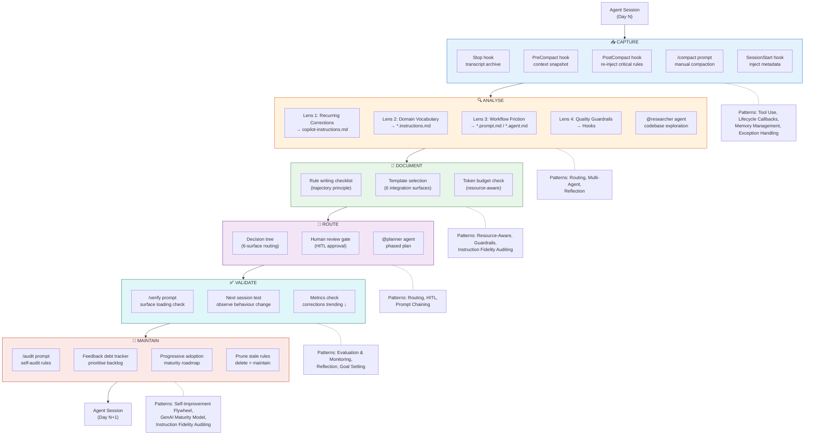

# Copilot Feedback System — Agentic Pattern Design

> **Date:** 2026-03-15
> **Status:** Draft — awaiting approval
> **Input:** [copilot-session-feedback-guide.md](../../.github/docs/copilot-session-feedback/copilot-session-feedback-guide.md), [patterns-catalogue.md](../../.github/skills/agentic-patterns/references/patterns-catalogue.md)

---

## System Summary

The **Copilot Session-to-Knowledge Feedback Loop** converts raw GitHub Copilot agent sessions into durable, reusable knowledge that improves each subsequent session. It is a six-stage pipeline:

```
Session → Capture → Analyse → Document → Route → Validate
   ↑                                                  │
   └──────────────────────────────────────────────────┘
```

**Goal:** Ensure every agent session produces at least one improvement to the agent's knowledge base, so each subsequent session starts with better context than the last. The Day 1 → Day 30 transformation is the success criterion.

**Inputs:**
- Raw session transcripts (JSON, from Stop hooks or GitHub cloud agent logs)
- PreCompact snapshots (JSON, exported before context compression)
- Manual compaction summaries (Markdown, from `/compact` prompt)
- Research / Plan / Implement plan files (Markdown, from RPI workflows)

**Outputs:**
- Rules in `copilot-instructions.md` (always-on project knowledge)
- Conditional instruction files (`*.instructions.md`) with `applyTo` scoping
- Prompt files (`*.prompt.md`) for repeatable slash commands
- Agent files (`*.agent.md`) with handoff chains
- Skill files (`SKILL.md`) with bundled references
- Hook configurations (JSON lifecycle callbacks)

**Essential Constraints:**
1. Must operate within GitHub Copilot's six VS Code extension surfaces — no external infrastructure required
2. Human review is mandatory before any knowledge is promoted to permanent instructions (guard against encoding bad patterns)
3. The system must be lightweight enough that developers actually use it — high friction equals abandonment
4. Session transcripts may contain sensitive code or proprietary logic — storage must respect privacy
5. The system itself is improved by the loop (meta-feedback) — the design must not preclude self-application

---

## Success Criteria

| # | Criterion | How to verify |
|---|-----------|---------------|
| 1 | Every pipeline stage (Capture / Analyse / Document / Route / Validate / Maintain) has at least one pattern assigned | Check Composition Design — all six stages are covered |
| 2 | Every pattern has a justification tied to a named pipeline stage | Check Recommended Patterns table — Justification column references specific stages |
| 3 | No pattern increases session friction beyond the current manual workflow | Check Risks table — four friction-flagged patterns have mitigations |
| 4 | All High-priority features can be implemented without external dependencies beyond VS Code + GitHub Copilot | Check Features to Implement — all High items use native surfaces (hooks, instructions, prompts) |
| 5 | The design handles the "sensitive transcript" constraint — no PII/code leaks to external services | Check Risks table — all capture mechanisms are local-only by default; Notification hook uses opt-in webhooks only |

---

## Reflection Notes

### Patterns Removed After Critique

- **Learning and Adaptation** (Gulli, Tier 2) — Removed because it is subsumed by Self-Improvement Flywheel (A&B), which more precisely describes the feedback loop's continuous improvement mechanism. Learning & Adaptation implies fine-tuning or RLHF, which this system does not perform.
- **Planning** (Gulli, Tier 1) — Removed as redundant. Already covered by Prompt Chaining (the pipeline's serial stages) and Multi-Agent (the RPI chain). Listing it separately adds no new design guidance.
- **Parallelization** (Gulli, Tier 1) — Removed. The four diagnostic lenses *could* run in parallel, but in practice a single developer reviews them sequentially. Adding parallelization orchestration contradicts the lightweight constraint without meaningful throughput gain.
- **R⁵ Model** (A&B, Tier 5) — Removed. The RPI workflow maps loosely to Receive-Reason-Retrieve-React-Report, but the mapping is cosmetic. Multi-Agent + Prompt Chaining already covers the same ground with more actionable guidance.
- **Decision Audit Trail** (A&B, Tier 5) — Removed. Already covered by Instruction Fidelity Auditing (audit rules) + git-tracked instruction files (version history). A formal cross-agent audit trail is over-engineering for a single-developer feedback loop.
- **Human Delegates to Agent** (A&B, Tier 5) — Removed. The `/compact` and `/audit` prompts are delegation, but they are adequately modelled by Human-in-the-Loop + Multi-Agent. A separate pattern designation adds no design value.
- **Memory-Augmented Agent** (A&B, Tier 5) — Merged into Memory Management (Gulli). Memory Management already covers the strategy; Memory-Augmented Agent describes the same concept at the implementation level. The design uses a unified memory treatment.

### Tiers With No Applicable Pattern — Justification

All five tiers contributed at least one pattern. No tier was found to be entirely inapplicable.

| Tier | Patterns Selected | Patterns Rejected (with reason) |
|------|------------------|---------------------------------|
| **Tier 1 — Core** | 5 (Prompt Chaining, Routing, Reflection, Tool Use, Multi-Agent) | Parallelization (no throughput need), Planning (subsumed) |
| **Tier 2 — Advanced** | 2 (Memory Management, Goal Setting) | Learning & Adaptation (subsumed by Flywheel), MCP (no protocol layer needed) |
| **Tier 3 — Production** | 2 (Exception Handling, HITL) | RAG (no vector store / semantic retrieval) |
| **Tier 4 — Enterprise** | 3 (Resource-Aware, Guardrails, Evaluation) | A2A (single instance), Reasoning (native to model), Prioritization (implicit in HITL P0–P3 matrix), Exploration (structured, not exploratory) |
| **Tier 5 — Architectural** | 4 (GenAI Maturity Model, Lifecycle Callbacks, Self-Improvement Flywheel, Instruction Fidelity Auditing) | Hierarchical Orchestrator (pipeline-based, not hierarchical; adds complexity), Agent Router (rule-based routing, not LLM-based), Blackboard (no async collaboration), Parallel Execution Consensus (no multi-verification need), Circuit Breaker (no external service dependency), Secure Agent (covered by Guardrails), Collaborative Co-piloting (general model, not a design choice), ReAct (agents use fixed procedures), Tool & Agent Registry (too few agents), R⁵ (subsumed), Decision Audit Trail (subsumed), Human Delegates to Agent (subsumed), Single Agent Baseline (implicit in maturity model), Memory-Augmented Agent (merged) |

### "Lightweight Enough to Use" Conflicts Flagged

Four selected patterns carry friction risk:

1. **Lifecycle Callbacks / AgentOps** — hooking every lifecycle event adds latency. *Mitigation:* start with only Stop and PostToolUse hooks; add others progressively per the adoption roadmap.
2. **Instruction Fidelity Auditing** — systematic auditing could feel bureaucratic. *Mitigation:* monthly cadence only; automate via `/audit` prompt; focus on deletion not addition.
3. **Multi-Agent (RPI chain)** — three agent files + handoff clicks adds workflow steps. *Mitigation:* this is Week 4 in the adoption roadmap; single-agent workflows are sufficient for Weeks 1–2.
4. **Evaluation & Monitoring** — tracking metrics manually is tedious. *Mitigation:* automate via SessionEnd hook for timestamps; keep manual tracking to a "corrections per session" tally only.

None of these conflicts warrant removing the pattern. All are mitigated by progressive adoption (start simple, add complexity only when justified by recurring need).

---

## Recommended Patterns

| # | Pattern | Source | Tier | Justification (specific to this system) |
|---|---------|--------|------|----------------------------------------|
| 1 | Prompt Chaining | Gulli | Core | The six-stage feedback pipeline (Capture → Analyse → Document → Route → Validate → Maintain) is a serial chain where each stage's output feeds the next. Each stage benefits from its own focused processing. |
| 2 | Routing | Gulli | Core | The **Analyse** stage uses four diagnostic lenses that classify each finding and route it to a specific integration surface. The **Route** stage implements an explicit decision tree (Section 5) that maps knowledge to one of six surfaces. |
| 3 | Reflection | Gulli | Core | The **Validate** stage tests whether new rules produce the intended behaviour change. The **Maintain** stage uses a self-audit prompt that critiques the knowledge base for contradictions, staleness, and gaps. Both are systematic self-critique. |
| 4 | Tool Use | Gulli | Core | The **Capture** stage depends on external tools: hooks execute shell scripts (formatters, git commands, file copy operations). The **Route** stage writes files to disk. Hooks invoke `jq`, `npx prettier`, `git`, and `curl`. |
| 5 | Multi-Agent | Gulli | Core | The RPI agent chain (`@researcher` → `@planner` → `@implementer`) assigns distinct expert roles across the **Analyse** and **Route** stages. Each agent has a scoped contract and hands off accumulated context. Pipeline topology. |
| 6 | Memory Management | Gulli | Advanced | The entire system IS memory management. `copilot-instructions.md` = long-term memory. Skills = procedural memory. `PostCompact` hook re-injection = working memory restoration. Copilot Memory (Section 6) = automatic episodic memory. The **Capture** stage (PreCompact snapshots) preserves context before compression destroys it. |
| 7 | Goal Setting & Monitoring | Gulli | Advanced | The **Validate** stage defines five success metrics: corrections per session, time to first correct output, feedback debt backlog size, stale rule count, and hook failure rate. The progressive adoption roadmap sets explicit per-week milestones with observable success criteria. |
| 8 | Exception Handling & Recovery | Gulli | Production | The **Capture** stage's hooks have an explicit exit code contract (0 = success, 2 = soft block, other = hard fail). The `stop_hook_active` loop guard prevents the most common hook failure (infinite Stop hook loop). The troubleshooting table (Section 9) documents failure modes and their recoveries. |
| 9 | Human-in-the-Loop | Gulli | Production | The **Route** stage requires mandatory human review before promoting any knowledge to permanent instructions. The rule writing checklist (Section 4) is a human quality gate. The priority matrix (P0–P3) structures human decision-making at the **Document** stage. The system explicitly states: "guard against encoding bad patterns." |
| 10 | Resource-Aware Optimization | Gulli | Enterprise | The **Document** stage enforces explicit token budgets: `copilot-instructions.md` < 200 lines (~3000 tokens), conditional instructions < 100 lines, skills < 500 lines, hook `additionalContext` < 200 tokens. The guide's context window budget section (Section 1) is resource management applied to the **Route** stage. |
| 11 | Guardrails / Safety | Gulli | Enterprise | The **Capture** stage's PreToolUse security gate hook blocks destructive operations (protected file deletion, dangerous terminal commands). The **Document** stage enforces the trajectory principle (positive framing only — negative descriptions increase reproduction probability). Template 6d is a concrete guardrail implementation. |
| 12 | Evaluation & Monitoring | Gulli | Enterprise | The **Validate** stage defines the `/verify` prompt that checks all six surfaces are properly loaded. The **Maintain** stage tracks stale rule count and hook failure rate. The SessionEnd hook logs metrics to `sessions/metrics/sessions.jsonl`. The measuring success table (Section 8) defines healthy targets. |
| 13 | GenAI Maturity Model | A&B | Architectural | The **Maintain** stage's progressive adoption roadmap (Week 1: Foundations → Week 2: Scoped Knowledge → Week 4: Advanced Workflows → Ongoing: Team Collaboration) mirrors the five maturity levels. Week 1 = Level 2 (Assisted), Week 2 = Level 3 (Automated), Week 4 = Level 4 (Coordinated). The guide explicitly says "start with `copilot-instructions.md` and grow outward." |
| 14 | Lifecycle Callbacks / AgentOps | A&B | Architectural | The **Capture** stage is built on VS Code's eight lifecycle hook events: SessionStart, SessionEnd, PreToolUse, PostToolUse, PreCompact, PostCompact, Stop, and Notification. These are the native lifecycle callback infrastructure. The hook system fires deterministically at defined events — the system cannot function without it. |
| 15 | Self-Improvement Flywheel | A&B | Architectural | The entire feedback loop IS a self-improvement flywheel: sessions produce corrections → corrections become rules → rules improve subsequent sessions → improved sessions produce fewer corrections. The Day 1 vs. Day 30 comparison (Section intro) illustrates the compounding effect. The feedback debt tracker is the flywheel's intake mechanism. The **Maintain** stage closes the loop. |
| 16 | Instruction Fidelity Auditing | A&B | Architectural | The **Validate** stage's `/audit` prompt systematically checks each rule against the codebase for contradictions, redundancy, and orphaned references. The rule writing checklist (positively framed? includes reasoning? specific enough? scoped correctly? non-contradictory? tested?) is a pre-commit instruction quality gate in the **Document** stage. |

---

## Composition Design

### Mermaid Diagram



### Pattern-to-Stage Mapping

| Pipeline Stage | Patterns Applied | Role in Stage |
|---------------|-----------------|---------------|
| **Capture** | Tool Use, Lifecycle Callbacks, Memory Management, Exception Handling | Hooks execute shell scripts at lifecycle events (Tool Use + Callbacks). PreCompact/PostCompact preserve context through compression (Memory Mgmt). Loop guards and exit codes prevent failures (Exception Handling). |
| **Analyse** | Routing, Multi-Agent, Reflection | Four diagnostic lenses classify findings and route to target surfaces (Routing). `@researcher` agent explores the codebase as a specialist (Multi-Agent). Lens application is structured self-critique of the session (Reflection). |
| **Document** | Resource-Aware Optimization, Guardrails, Instruction Fidelity Auditing | Token budgets constrain artifact size (Resource-Aware). Trajectory principle and rule writing checklist enforce quality (Guardrails + IFA). |
| **Route** | Routing, Human-in-the-Loop, Prompt Chaining | Decision tree maps knowledge to the correct surface (Routing). Human review gate prevents encoding bad patterns (HITL). Pipeline chain connects staging to deployment (Prompt Chaining). |
| **Validate** | Evaluation & Monitoring, Reflection, Goal Setting & Monitoring | `/verify` checks surfaces are loaded (Evaluation). Next-session testing confirms behaviour change (Reflection). Metrics track improvement trajectory (Goal Setting). |
| **Maintain** | Self-Improvement Flywheel, GenAI Maturity Model, Instruction Fidelity Auditing | The loop itself is a compounding improvement cycle (Flywheel). Progressive adoption scales complexity over time (Maturity). `/audit` prunes stale rules (IFA). |

### Data Flow

```
Session Transcript (JSON)
    │
    ├── Stop hook copies to sessions/YYYY-MM-DD/
    ├── PreCompact hook exports to sessions/precompact/
    └── /compact creates sessions/YYYY-MM-DD-<desc>.md
            │
            ▼
    Four Diagnostic Lenses (human-driven analysis)
            │
            ├── Recurring Correction → copilot-instructions.md rule
            ├── Vocabulary Gap → *.instructions.md with applyTo
            ├── Workflow Friction → *.prompt.md or *.agent.md
            └── Quality Guardrail → Hook JSON configuration
                    │
                    ▼
            Human Review Gate (rule writing checklist)
                    │
                    ▼
            File committed to .github/ (git-tracked)
                    │
                    ▼
            /verify in next session → behaviour confirmed
                    │
                    ▼
            /audit monthly → prune stale rules
```

### Human Gates

Three explicit human gates in the pipeline:

1. **Analyse → Document gate:** The developer decides which lens findings are worth formalising (priority matrix P0–P3). Not every session finding becomes a rule.
2. **Document → Route gate:** The rule writing checklist is a human quality check before the artifact is placed. Framing, reasoning, specificity, scope, and non-contradiction must all pass.
3. **Route → Validate gate:** The developer commits the artifact and starts a new session to confirm it produces the intended behaviour change. Uncommitted artifacts are not yet "promoted."

---

## Risks and Mitigations

| Pattern | Risk in this system | Mitigation |
|---------|---------------------|------------|
| Prompt Chaining | Pipeline stall — developer skips the Capture stage, breaking the chain. Without capture, no analysis is possible. | Design each stage to be independently useful. The `/compact` prompt works standalone. Hooks automate capture with zero effort after initial setup. |
| Routing | Misclassification — a finding is routed to the wrong integration surface (e.g., a hook-worthy guardrail is written as an instruction that the agent can ignore). | The Mermaid decision tree (Section 5) provides visual routing. The human review gate catches misroutes before commit. Include the routing tree as a conditional instruction. |
| Reflection | Over-auditing — the `/audit` prompt flags too many "issues," creating audit fatigue. Developer stops running it. | Run audit monthly, not per-session. Set clear action thresholds: only act on rules flagged as "contradicted" or "orphaned." Ignore "redundant" unless the rule count exceeds 50. |
| Tool Use | Hook script failures cascade silently — a broken hook returns non-zero and the developer doesn't notice. | Exit code contract (0/2/other) with defined semantics. Manual debugging workflow (Section 9). Test hooks independently with sample stdin before deployment. |
| Multi-Agent | Handoff context loss — the `@researcher` agent's findings are summarised too aggressively during handoff to `@planner`, losing critical file references. | VS Code's handoff mechanism preserves full accumulated context. Keep agent scopes narrow so context stays focused. Researcher output template mandates exact file:line references. See fallback table below. |
| Memory Management | Knowledge base grows unbounded — 60+ rules in `copilot-instructions.md` causes the agent to "forget" later rules as the context window fills. | Enforce token budget rules from the guide: < 200 lines for global instructions, < 100 lines per conditional instruction. Split aggressively into scoped `*.instructions.md` files. Prune monthly via `/audit`. |
| Goal Setting & Monitoring | Vanity metrics — developer tracks "number of rules written" instead of "corrections per session." More rules ≠ better. | The guide explicitly calls "rule count" an anti-metric. Focus on corrections-per-session (trending ↓) and stale-rule-count (should be 0). |
| Exception Handling | Stop-hook infinite loop — the single most common hooks mistake (documented in Section 9). Forgetting `stop_hook_active` guard creates an unbreakable loop. | Every Stop hook template includes the guard. The security gate skill/instruction must mandate this pattern. Add a `PreToolUse` hook that validates Stop hook scripts for the guard. |
| Human-in-the-Loop | Gate fatigue — developer rubber-stamps rule reviews because the checklist feels like busywork. Bad patterns get encoded. | Limit to one P1 + one P2 rule per session (guide's discipline rule). Keep the checklist to 6 items. If a session surfaces 5+ findings, log them in feedback-debt.md and spread across sessions. |
| Resource-Aware Optimization | Over-constraining — token budgets are set too tight, forcing artificial truncation of rules that need nuance. | Start with the guide's recommended limits (200/100/500/200 tokens). Adjust upward only if the agent consistently forgets rules. Monitor via "rule followed early but forgotten later" symptom in troubleshooting table. |
| Guardrails / Safety | False positives — the PreToolUse security gate blocks legitimate file deletions or terminal commands, frustrating the developer. | Use exit code 2 (soft block with explanation), not hard failure. Allow the developer to override. Keep the protected-patterns list short and project-specific. |
| Evaluation & Monitoring | Measurement overhead — collecting session metrics becomes a chore that the developer abandons. | Automate via SessionEnd hook (timestamp + session_id logged to JSONL). Manual tracking limited to a tally of corrections at session end — no forms, no dashboards. |
| GenAI Maturity Model | Over-engineering — developer jumps to Week 4 (agent chains, skills) before Week 1 (basic rules) is solid. Fragile advanced setup on a weak foundation. | The progressive adoption roadmap enforces sequencing. Each week has explicit success criteria that must be met before advancing. The design document references this. |
| Lifecycle Callbacks | Hook overhead — hooking every lifecycle event adds latency to every tool call, slowing the agent noticeably. | Start with only Stop + PostToolUse hooks (Week 2). Add SessionStart, PreCompact, PostCompact in Week 4. Never hook events with no justified use case. Keep scripts < 500ms execution time. |
| Self-Improvement Flywheel | Encoding bad patterns — the flywheel amplifies mistakes if bad corrections are formalised into rules. A wrong rule compounds across many sessions. | Human review gate is the primary defence. The rule writing checklist requires reasoning ("Reason: ..."). The `/audit` prompt detects contradicted rules. The 28-day TTL on Copilot Memory provides automatic expiry for unvalidated patterns. |
| Instruction Fidelity Auditing | Audit becomes bureaucratic overhead — running `/audit` monthly and reviewing the output feels like a compliance task. | Frame the audit as a deletion exercise, not a review exercise. The goal is to remove rules, not to validate them. A smaller, accurate rule set is the reward. Run it once monthly; skip if the knowledge base has < 15 rules. |

### RPI Chain Fallback Procedures

When an RPI chain agent fails to produce its required handoff artifact, use the table below to
recover. Each fallback is a human-actioned last resort — not a workflow shortcut. Prefer
re-invoking the failing agent with a narrower scope before falling back.

| Failure mode | Symptom | Fallback procedure |
|---|---|---|
| `@researcher` produces no findings | The Findings table is empty or the agent stops without output | Apply the four diagnostic lenses manually using `.github/instructions/feedback-lenses.instructions.md` directly on the session summary. Produce the findings table by hand and hand it to `@planner` as inline context. |
| `@planner` produces no phased plan | The agent completes without saving a plan file under `sessions/plans/` | Use the `@researcher` findings table as the specification. Invoke `@implementer` directly with that table as context, accepting reduced structure. Document the deviation in the session notes. |
| `@implementer` stalls mid-plan | The agent stops partway through, leaving some steps incomplete | Note the last completed step number from the TODO list. Re-invoke `@implementer` with the original plan file path and the instruction: "Resume from step N — all prior steps are complete." Verify preconditions for step N before resuming. |

---

## Features to Implement

### Capture Stage

| # | Feature / Artefact | Pattern(s) | Type | Priority | Notes |
|---|-------------------|------------|------|----------|-------|
| 1 | Stop hook: auto-archive session transcripts to `sessions/YYYY-MM-DD/` | Tool Use, Lifecycle Callbacks, Exception Handling | Hook | **High** | Template 6c in the guide. Must include `stop_hook_active` loop guard. Required for any downstream analysis. |
| 2 | `/compact` prompt: manual session compaction to structured Markdown | Self-Improvement Flywheel, Memory Management | Prompt | **High** | Template in Section 2C. Works standalone with zero setup. Highest-value single artifact. |
| 3 | PreCompact hook: export full context snapshot before compression | Memory Management, Lifecycle Callbacks | Hook | **Medium** | Captures what the agent knew before compaction destroyed it. Useful for diagnosing "agent forgot my rules" issues. |
| 4 | PostCompact hook: re-inject critical rules after context compression | Memory Management, Exception Handling | Hook | **Medium** | Prevents rule loss during long sessions. Keep `additionalContext` < 200 tokens. |
| 5 | SessionStart hook: inject project metadata (name, version, branch) | Tool Use, Lifecycle Callbacks | Hook | **Medium** | Template 6a. Provides orientation context at session start. |
| 6 | SessionEnd hook: log session metrics (timestamp, session_id) | Evaluation & Monitoring, Lifecycle Callbacks | Hook | **Low** | Template 6e. Enables tracking session frequency and duration over time. |
| 7 | Notification hook: route agent notifications to external systems | Lifecycle Callbacks | Hook | **Low** | Template 6f. Opt-in Slack/Teams webhook. Only needed for team-scale adoption. |

### Analyse Stage

| # | Feature / Artefact | Pattern(s) | Type | Priority | Notes |
|---|-------------------|------------|------|----------|-------|
| 8 | Four diagnostic lenses reference instruction | Routing, Reflection | Instruction | **High** | Conditional instruction (`applyTo` for `sessions/**`) or section in `copilot-instructions.md`. Defines the four lenses and their target surfaces. |
| 9 | `/research` prompt: structured codebase research template | Routing, Prompt Chaining | Prompt | **Medium** | Template 3 in the guide. First step in the RPI workflow. Read-only exploration. |
| 10 | `@researcher` agent: codebase exploration specialist | Multi-Agent, Routing | Agent | **Medium** | Template 4. Read-only agent with handoff to `@planner`. Week 4 adoption. |
| 11 | `feedback-analyser` skill: apply lenses to session artifacts | Routing, Reflection | Skill | **Low** | Codifies the lens analysis procedure as portable procedural memory. Useful when the feedback process is mature. |

### Document Stage

| # | Feature / Artefact | Pattern(s) | Type | Priority | Notes |
|---|-------------------|------------|------|----------|-------|
| 12 | Rule writing checklist as conditional instruction | Guardrails, Instruction Fidelity Auditing | Instruction | **High** | The six-item checklist from Section 4. Auto-applied when editing `*.instructions.md` or `copilot-instructions.md`. |
| 13 | Token budget reference instruction | Resource-Aware Optimization | Instruction | **Medium** | Documents the size limits (200 lines / 100 lines / 500 lines / 200 tokens) as a rule in `copilot-instructions.md`. |
| 14 | Integration surface templates (Templates 1–6) | Resource-Aware, Guardrails | Instruction/Prompt | **Medium** | All six templates from Section 4. Can be packaged as a `template-library` skill with on-demand references. |

### Route Stage

| # | Feature / Artefact | Pattern(s) | Type | Priority | Notes |
|---|-------------------|------------|------|----------|-------|
| 15 | Routing decision tree instruction | Routing, Human-in-the-Loop | Instruction | **High** | The Mermaid flowchart from Section 5 as a conditional instruction. Provides the agent with explicit routing guidance during Document/Route stages. |
| 16 | `@planner` agent: phased implementation planning | Multi-Agent, Prompt Chaining | Agent | **Medium** | Template 4b. Receives research from `@researcher`, produces phased plan. Hands off to `@implementer`. Week 4 adoption. |
| 17 | `@implementer` agent: plan execution | Multi-Agent, Tool Use | Agent | **Medium** | Template 4c. Executes plans step by step with test verification. Week 4 adoption. |
| 18 | PreToolUse hook: security gate | Guardrails, Exception Handling | Hook | **High** | Template 6d. Blocks deletion of protected files and destructive terminal commands. Exit code 2 for soft block. |

### Validate Stage

| # | Feature / Artefact | Pattern(s) | Type | Priority | Notes |
|---|-------------------|------------|------|----------|-------|
| 19 | `/verify` prompt: check all surfaces are loaded and active | Evaluation & Monitoring, Reflection | Prompt | **High** | Template from Section 10. Start-of-session sanity check. Confirms instructions, skills, and hooks are wired correctly. |
| 20 | Success metrics tracking instruction | Goal Setting & Monitoring, Evaluation | Instruction | **Medium** | Documents the five metrics (corrections/session, time to first correct output, feedback debt size, stale rule count, hook failure rate) as a rule in `copilot-instructions.md`. |
| 21 | PostToolUse hook: auto-format after file edits | Tool Use, Guardrails, Lifecycle Callbacks | Hook | **Medium** | Template 6b. Runs project formatter on every file edit. Week 2 adoption. |

### Maintain Stage

| # | Feature / Artefact | Pattern(s) | Type | Priority | Notes |
|---|-------------------|------------|------|----------|-------|
| 22 | `/audit` prompt: self-audit instruction quality | Reflection, Instruction Fidelity Auditing | Prompt | **High** | Template from Section 7. Checks all rules against codebase for contradictions, redundancy, orphaned references. Monthly cadence. |
| 23 | Feedback debt tracker (`sessions/feedback-debt.md`) | Self-Improvement Flywheel, Goal Setting | Instruction | **Medium** | Template from Section 7. Tracks observations, session count, priority, status. Updated per-session or per-PR. |
| 24 | Progressive adoption roadmap instruction | GenAI Maturity Model | Instruction | **Low** | The Week 1 → 2 → 4 → Ongoing roadmap as a reference document. Prevents over-engineering. |
| 25 | End-of-session feedback checklist (Stop hook injection) | Self-Improvement Flywheel, Lifecycle Callbacks | Hook | **Low** | Inject the six-item checklist from Section 10 as `additionalContext` in the Stop hook. Reminds the developer to capture feedback. |

### Summary by Priority

| Priority | Count | Items |
|----------|-------|-------|
| **High** | 8 | #1 (Stop hook), #2 (/compact), #8 (lenses instruction), #12 (rule checklist), #15 (routing tree), #18 (security gate), #19 (/verify), #22 (/audit) |
| **Medium** | 12 | #3, #4, #5, #9, #10, #13, #14, #16, #17, #20, #21, #23 |
| **Low** | 5 | #6, #7, #11, #24, #25 |

### Implementation Phases (aligned with Progressive Adoption Roadmap)

**Week 1 — Foundations (High-priority items):**
- Feature #2: `/compact` prompt
- Feature #8: Four diagnostic lenses instruction
- Feature #12: Rule writing checklist instruction
- Feature #15: Routing decision tree instruction
- Feature #19: `/verify` prompt
- Feature #22: `/audit` prompt

**Week 2 — Automation (High + first Medium items):**
- Feature #1: Stop hook (transcript capture)
- Feature #18: PreToolUse security gate hook
- Feature #21: PostToolUse auto-format hook
- Feature #9: `/research` prompt
- Feature #13: Token budget instruction

**Week 4 — Advanced (remaining Medium items):**
- Features #3, #4, #5: PreCompact, PostCompact, SessionStart hooks
- Features #10, #16, #17: RPI agent chain (@researcher, @planner, @implementer)
- Feature #14: Template library skill
- Feature #20: Success metrics instruction
- Feature #23: Feedback debt tracker

**Ongoing — Team scale (Low items):**
- Features #6, #7: SessionEnd and Notification hooks
- Feature #11: Feedback-analyser skill
- Feature #24: Progressive adoption roadmap instruction
- Feature #25: End-of-session checklist hook injection

---

## Next Steps

The design document has been saved to `docs/design/copilot-feedback-system-pattern-design.md`.

To move to the planning phase:

1. **Start with Week 1 features** — the six High-priority prompt and instruction files require no hooks infrastructure and can be created immediately:
   - `/compact` prompt → `.github/prompts/compact.prompt.md`
   - `/verify` prompt → `.github/prompts/verify.prompt.md`
   - `/audit` prompt → `.github/prompts/audit.prompt.md`
   - Four lenses instruction → `.github/instructions/feedback-lenses.instructions.md`
   - Rule writing checklist → `.github/instructions/rule-writing.instructions.md`
   - Routing decision tree → `.github/instructions/routing.instructions.md`

2. **Use `@planner`** with the Features to Implement table as input to produce a phased implementation plan with file-level granularity.

3. **Or use `@implementer`** directly to scaffold the Week 1 artefacts using the templates from the guide (Section 4).

4. **Do not skip to Week 4 features** (agent chains, lifecycle hooks) until Week 1 surfaces are validated in at least two sessions.
